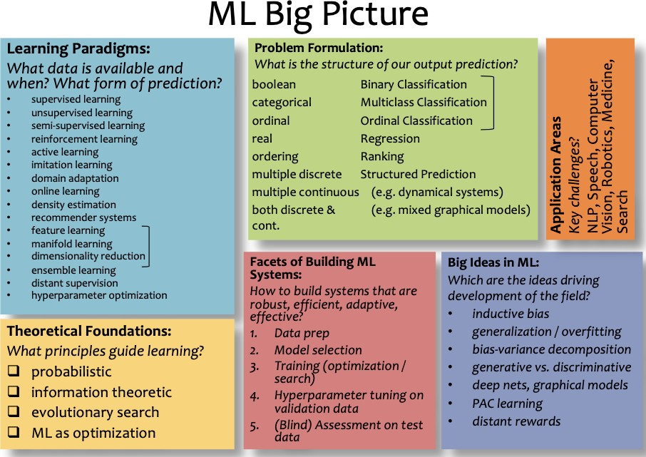
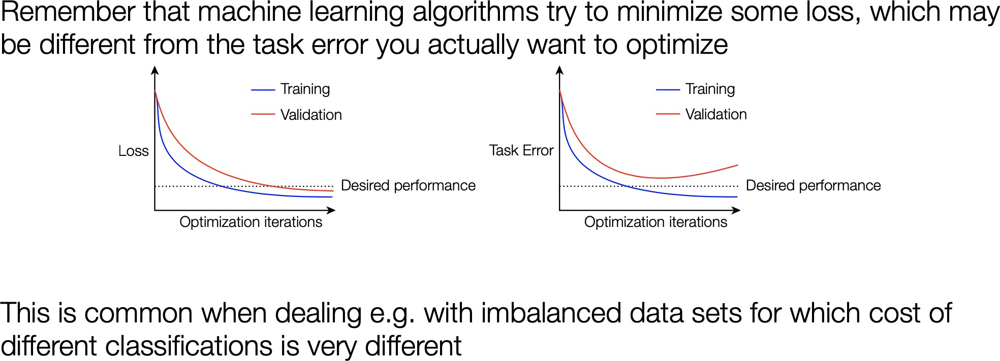

# Overview

## Types:

Supervised learning: labeled data:

**Classification** \(categorical output, discrete\):

**Regression** \(numerical output, continuous\),

**Structured prediction**

Unsupervised learning: only unlabeled data

Clustering

Dimensionality reduction

Density estimation / generative modeling

Anomaly detection

Discovering latent factors and structures

## Big Picture

## !!! Model summary

Consider loss vs. task error

Supervised learning

| Algorithm | Hypothesis | Loss fuction | Optimization method |
| :--- | :--- | :--- | :--- |
| Linear regression | Linear | Any regression loss | Any |
| SVM | Linear or kernel | Hinge loss | Any |
| Logistic regression | \(usually\) linear | Logistic loss | Any |
| NN | composed non-linear function | Any | \(usually\) gradient descent |
| DT | Axis-alligned halfplanes | Log probability under bernoulli model | Greedy search |
| Naive Bayes | Linear | Joint probability of data and output | Analytic solution |
| Gradient boosting | Ensemble of other models | Any | gradient descent |

