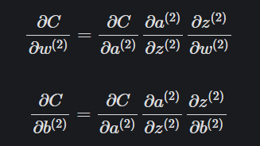
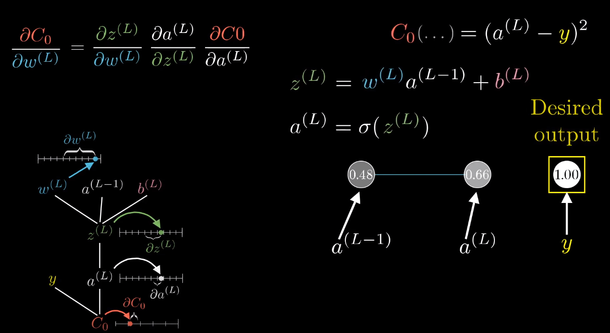
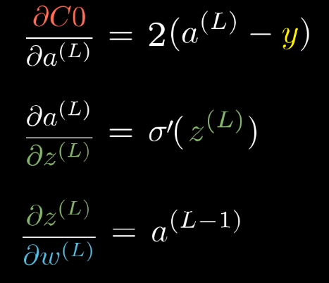
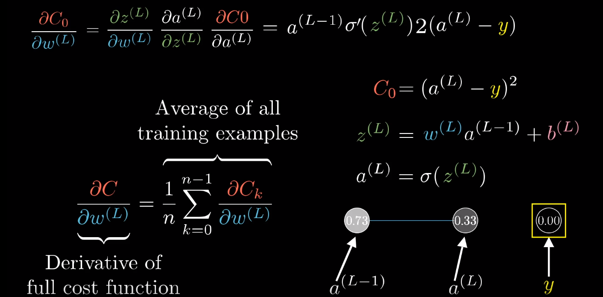
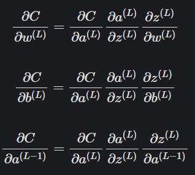
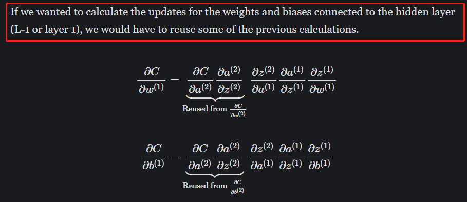
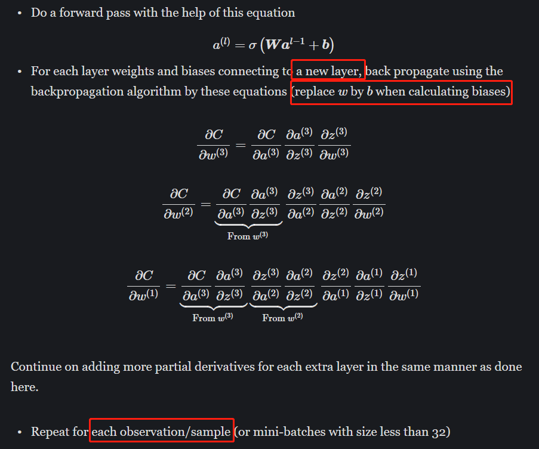

# Backpropagation Explain and Resources

Suppose two hidden layers MLP:

**Backpropagation aims to find which weight/bias/activation function has the relatively larger influence on minimize the cost and update them correspondingly.**

For example:

This is the cost – weight/bias of hidden layer 2, to calculate the ratio between the weights \(and biases\) and the cost function. The ones with the largest ratio will have the greatest impact on the cost function and will give us 'the most bang for our buck'.

Ex. We want to increase the prob to classify it into 2, we would like to know which neuron’s weight/bias/activation has larger influence so that we can adjust them to get our desired output - 2, such as the yellow line.

We will have to average the changes

Math formula \(output – the last hidden layer\):

With multiple layers and neurons:

Calculating the gradient

Formula for the hidden layer 1:

Extra hidden layer:

**Summarization**

Resources:

[https://mlfromscratch.com/neural-networks-explained/\#backpropagation](https://mlfromscratch.com/neural-networks-explained/#backpropagation)

[https://www.youtube.com/watch?v=Ilg3gGewQ5U](https://www.youtube.com/watch?v=Ilg3gGewQ5U)

