# Bootstrap, Bagging, and Boosting

## Bootstrap

### Codes

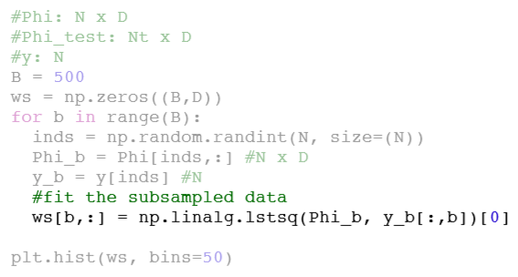

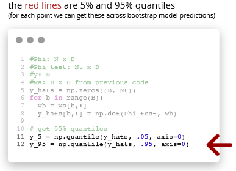

## Bagging (Bootstrap aggregating)

**Use bootstrap for more accurate prediction (not just uncertainty)**

### Bagging for regression

Will lower variance but same bias

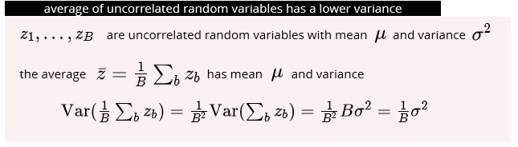

### Bagging for classification

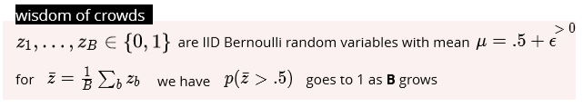

mode of iid classifiers that are better than chance is a better classifier

* use voting

crowds are wiser when

* individuals are better than random
* votes are uncorrelated

### Example

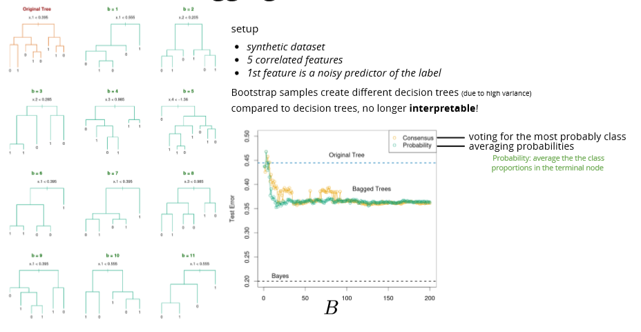

## Random forests

Reduce the correlation between decision trees

Feature sub-sampling

only a random subset () of features are available for split at each step (further reduce the dependence between decision trees)

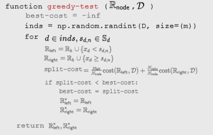

Features of Random Forest

* It is unexcelled in accuracy among current algorithms.
* It runs efficiently on large data bases.
* It can handle thousands of input variables without variable deletion.
* It gives estimates of what variables are important in the classification.
* It generates an internal unbiased estimate of the generalization error as the forest building progresses.
* It has an effective method for estimating missing data and maintains accuracy when a large proportion of the data are missing.
* It has methods for balancing error in class population unbalanced data sets.
* Generated forests can be saved for future use on other data.
* Prototypes are computed that give information about the relation between the variables and the classification.
* It computes proximities between pairs of cases that can be used in clustering, locating outliers, or (by scaling) give interesting views of the data.
* The capabilities of the above can be extended to unlabeled data, leading to unsupervised clustering, data views and outlier detection.
* It offers an experimental method for detecting variable interactions

**Random forest does not overfit because each tree is independent and starts from scratch and Random Forest takes the average of all the predictions, which makes the biases cancel each other out. In general, more trees will be resulted in more stable generalization errors. **

.png>)

**formula prove:**



****

### Out of bag (OOB) samples

* the instances not included in a bootstrap dataset can be used for validation
* simultaneous validation of decision trees in a forest
* no need to set aside data for cross validation

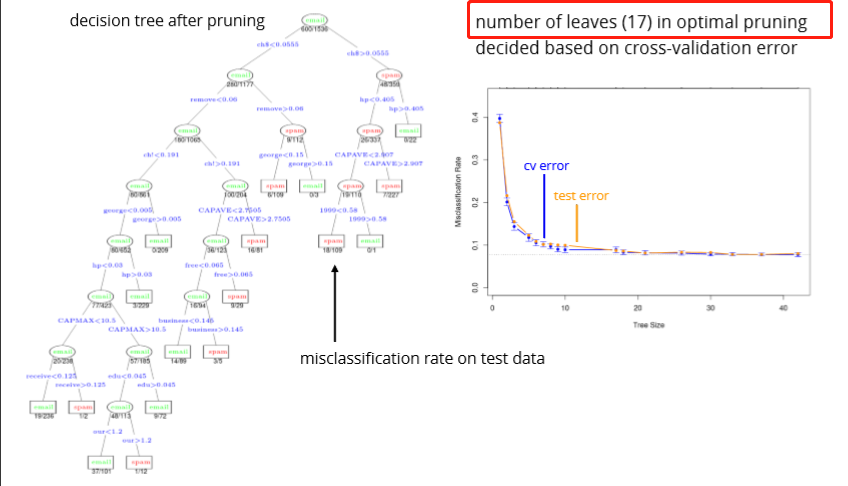

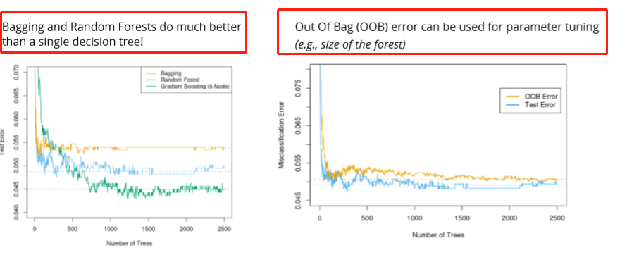

**Out Of Bag (OOB)** error can be used for parameter tuning (e.g., size of the forest)

## Summary

* Bootstrap is a powerful technique to get **uncertainty estimates**
* Bootstrap aggregation (Bagging) can reduce the variance of unstable models
* Random forests (**subsample data and features**):
* Bagging + further de-correlation of features at each split
* **OOB validation instead of CV**
* destroy interpretability of decision trees
* perform well in practice
* can fail if only few relevant features exist (due to feature-sampling)

## Adaptive bases

### Optimization idea

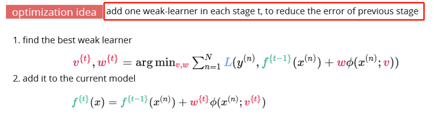

### Example

## Exponential loss

note that the loss grows faster than the other surrogate losses (more sensitive to outliers)

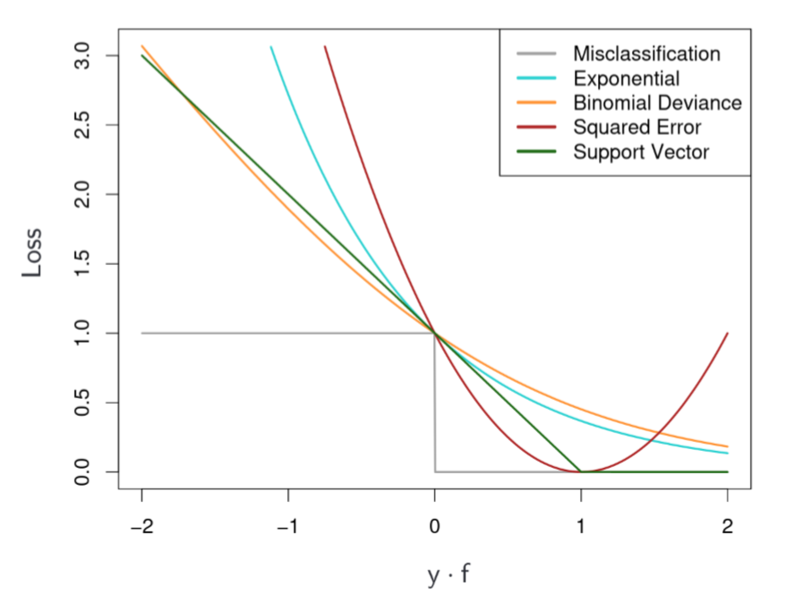

AdaBoost

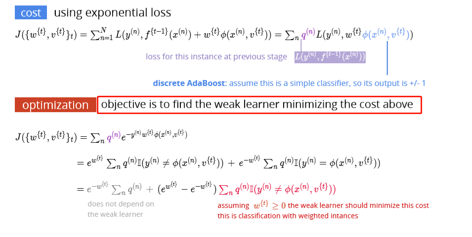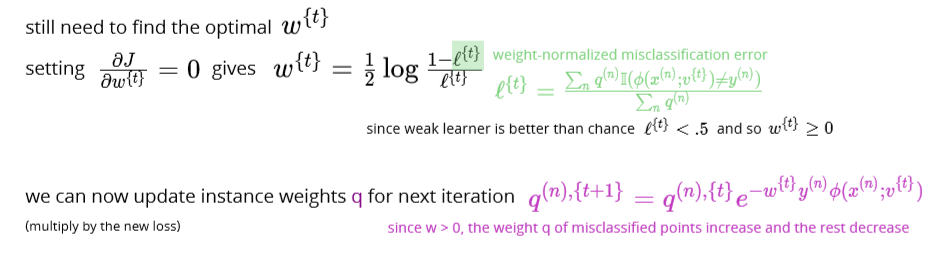

## AdaBoost algorithm

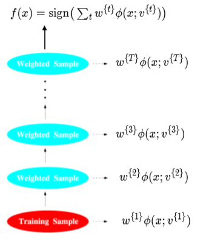

AdaBoost detailed derivations

Discrete AdaBoost

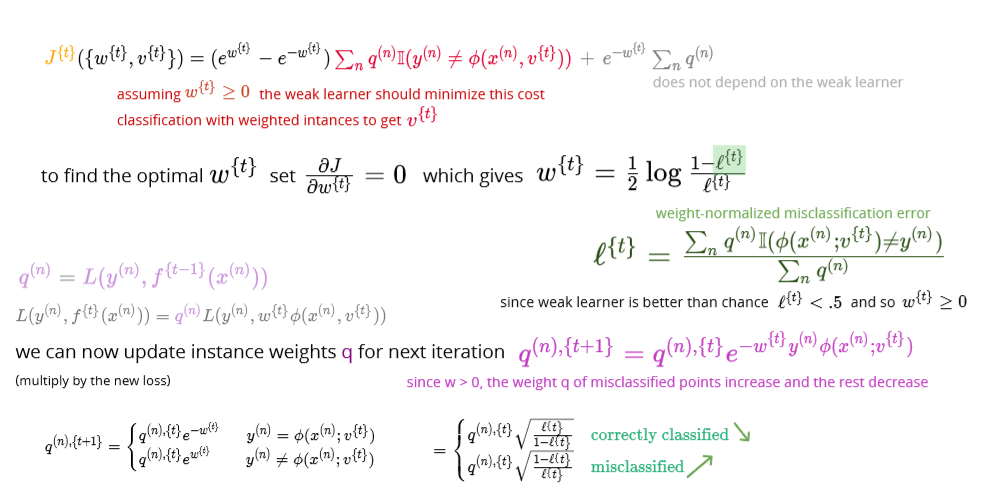

## Discrete AdaBoost Algorithm Example

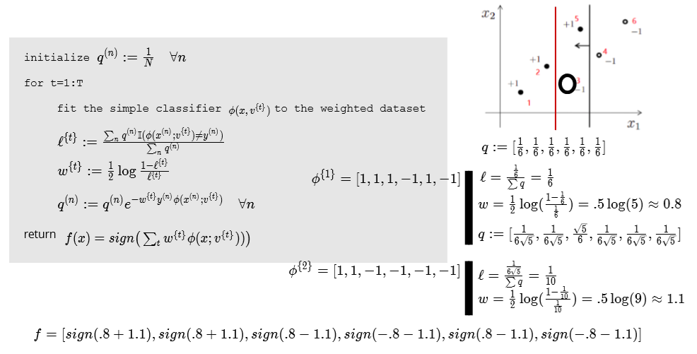

### Example

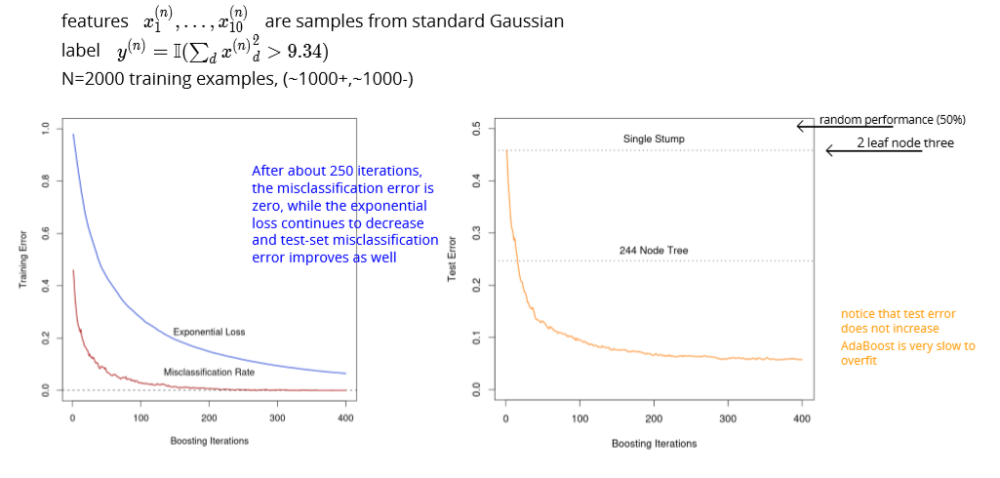

**Decision stump: decision tree with one node**

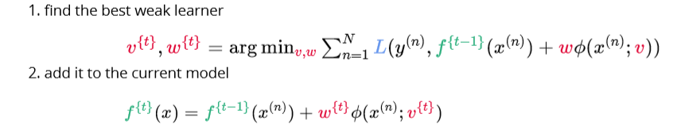

## Gradient boosting

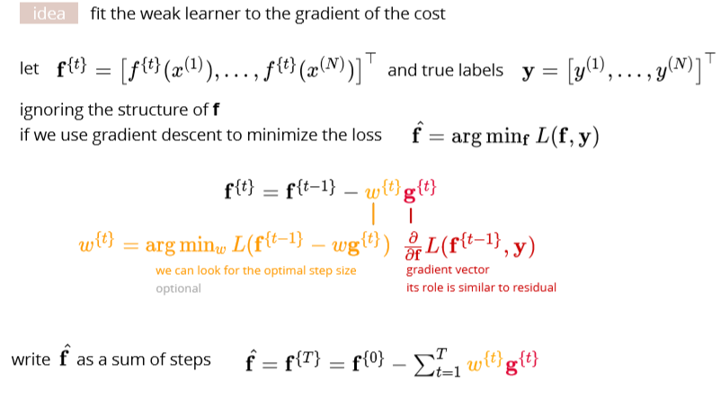

### Algorithm

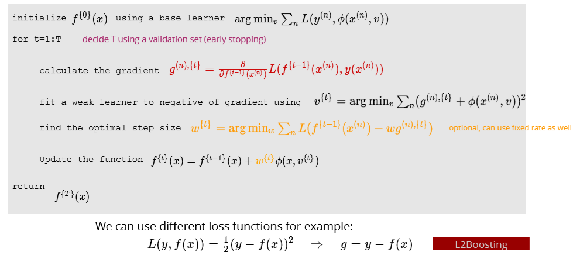

## Gradient tree boosting

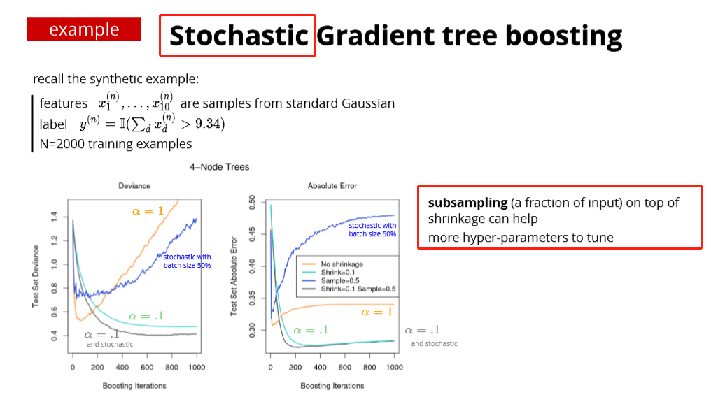

two ensemble methods

* bagging & random forests (reduce variance)
  * produce models with minimal correlation
  * use their average prediction
* boosting (reduces the bias of the weak learner)
  * models are added in steps
  * a single cost function is minimized
  * for exponential loss: interpret as re-weighting the instance (AdaBoost)
  * gradient boosting: fit the weak learner to the negative of the gradient
  * interpretation as L1 regularization for "weak learner"-selection
  * also related to max-margin classification (for large number of steps T)
* random forests and (gradient) boosting generally perform very well

## Some loss functions for gradient boosting

## !!!Boosting vs Bagging

1、Bagging (bootstrap aggregating)

Bagging即套袋法，其算法过程如下：

A）从原始样本集中抽取训练集。每轮从原始样本集中使用Bootstrapping的方法抽取n个训练样本（在训练集中，有些样本可能被多次抽取到，with replacement而有些样本可能一次都没有被抽中）。共进行k轮抽取，得到k个训练集。（k个训练集之间是相互独立的）

B）每次使用一个训练集得到一个模型，k个训练集共得到k个模型。（注：这里并没有具体的分类算法或回归方法，我们可以根据具体问题采用不同的分类或回归方法，如决策树、感知器等）

C）对分类问题：将上步得到的k个模型采用投票voting的方式得到分类结果；对回归问题，计算上述模型的均值作为最后的结果。（所有模型的重要性相同）

2、Boosting

其主要思想是将弱分类器组装成一个强分类器。在PAC（概率近似正确）学习框架下，则一定可以将弱分类器组装成一个强分类器。

关于Boosting的两个核心问题：

1）在每一轮如何改变训练数据的权值或概率分布？

通过提高那些在前一轮被弱分类器分错样例的权值，减小前一轮分对样例的权值，来使得分类器对误分的数据有较好的效果。

2）通过什么方式来组合弱分类器？

通过加法模型将弱分类器进行线性组合，比如AdaBoost通过加权多数表决的方式，即增大错误率小的分类器的权值，同时减小错误率较大的分类器的权值。

而提升树通过拟合残差的方式逐步减小残差，将每一步生成的模型叠加得到最终模型。

3、Bagging，Boosting二者之间的区别

Bagging和Boosting的区别：

1）样本选择上：

Bagging：训练集是在原始集中有放回选取的，从原始集中选出的各轮训练集之间是独立的。

Boosting：每一轮的训练集不变，只是训练集中每个样例在分类器中的权重发生变化。而权值是根据上一轮的分类结果进行调整。

2）样例权重：

Bagging：使用均匀取样，每个样例的权重相等

Boosting：根据错误率不断调整样例的权值，错误率越大则权重越大。(分错多的多权重)

3）预测函数：

Bagging：所有预测函数的权重相等。

Boosting：每个弱分类器都有相应的权重，最后voting时， 对于分类误差小的分类器会有更大的权重。

4）并行计算：

Bagging：各个预测函数可以并行生成

Boosting：各个预测函数只能顺序生成，因为后一个模型参数需要前一轮模型的结果。

### When to choose which

There’s not an outright winner; it depends on the data, the simulation and the circumstances.\
Bagging and Boosting decrease the variance of your single estimate as they combine several estimates from different models. So the result may be a model with **higher stability**.

If the problem is that the single model gets a very low performance, Bagging will rarely get a **better bias**. However, Boosting could generate a combined model with lower errors as it optimises the advantages and reduces pitfalls of the single model.

By contrast, if the difficulty of the single model is **over-fitting**, then Bagging is the best option. Boosting for its part doesn’t help to avoid over-fitting; in fact, this technique is faced with this problem itself. For this reason, Bagging is effective more often than Boosting.



## Maximum Likelihood Estimation

1. given a pdf
2. 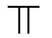the pdf w.r.t X
3. Log step 2
4. Get the derivate = 0 w.r.t the estimator you would like to
5. Get the MLE w.r.t the estimator

[https://daviddalpiaz.github.io/stat3202-sp19/homework/pp-03-soln.pdf](https://daviddalpiaz.github.io/stat3202-sp19/homework/pp-03-soln.pdf)

pg. 4

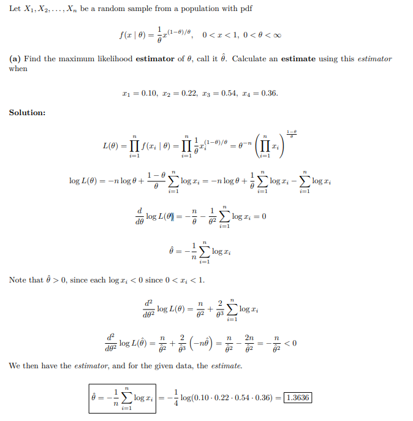

