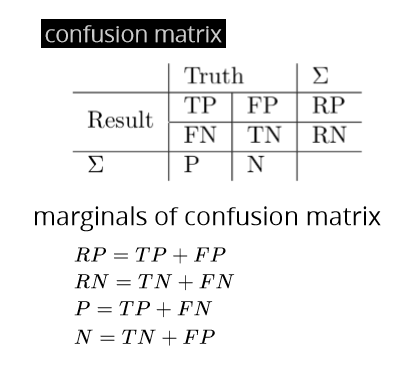
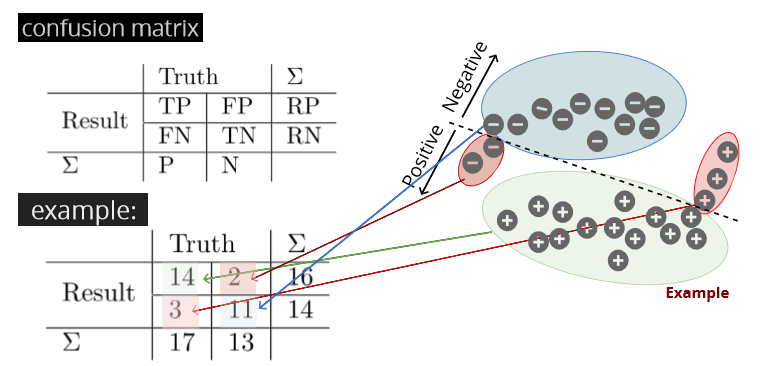
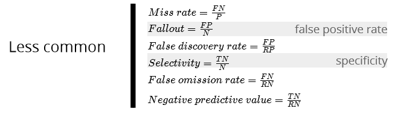
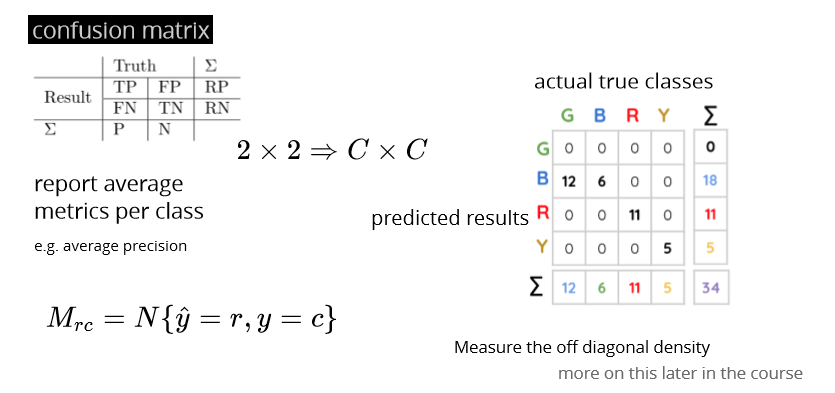
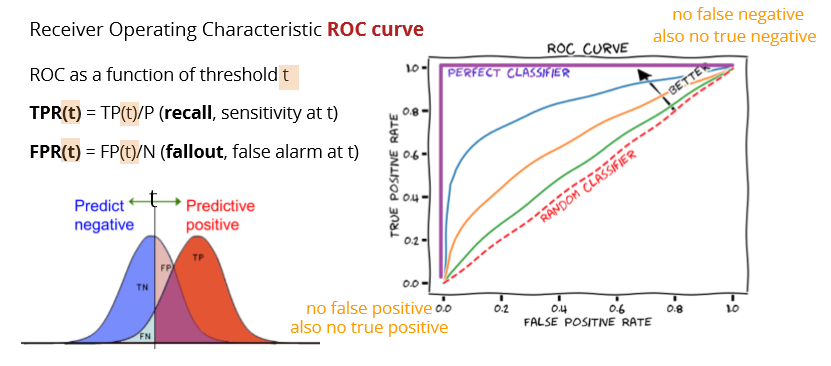
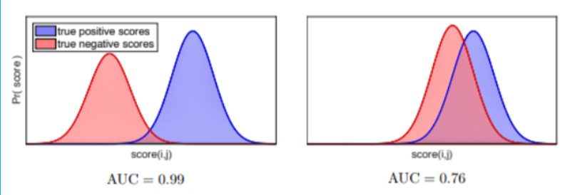

# Evaluation

## Evaluation and comparison

Each model with same cost functions: report loss

Eg. Least squares or cross entropy

Each model with different cost functions:

Standard evaluation measures/metrics

## Performance metrics for classification

**False positive \(type 1\)**

**False negative \(type 2\)**

Eg: patient does not have disease but received positive diagnostic \(Type I error\)

patient has disease but it was not detected \(Type II error\)  

a message that is not spam is assigned to the spam folder \(Type I error\)

a message that is spam appears in the regular folder \(Type II error\)

confusion matrix

Accuracy, error rate, precision, recall, F1 score:

Fbeta score

### Example precision recall

### Less common metrics:

## Performance metrics for multi-class classification

Report average metrics per class, eg. Average precision

## Trade-off between precision and recall ROC&AUC

**To compare classification algorithms compare their Area Under the Curve \(AUC\)**

Note that higher AUC doesn’t mean all performance measures are better

**Also important when comparing ranking algorithms e.g. search results**

**Intuition**: AUC is equivalent to the probability of ranking a random positive example higher than a random negative example

## Cross validation in Evaluation

Over-fitting in Model Selection

more severe on small dataset and when having too many hyper-parameters but present even with few hyperparameters \(小数据更易，很多hyper结果跟很少hyper相似\)

### Nested CV

