# Gradient Computation & Automatic Differentiation

## Landscape of the cost function

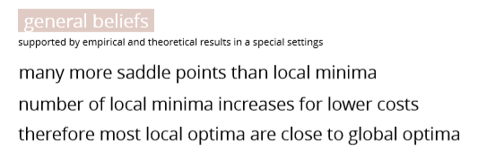

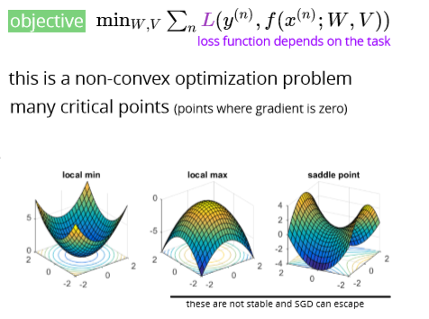

## Jacobian matrix

## Chain rule

## Training a two layer MLP

## Gradient calculation

### For regression

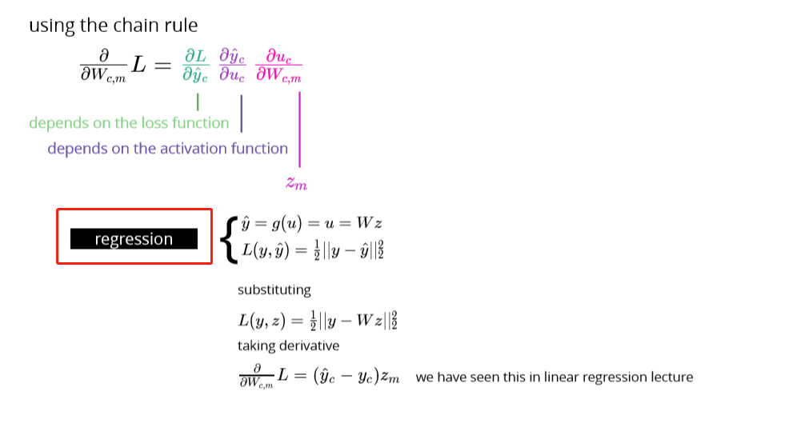

### For binary classification

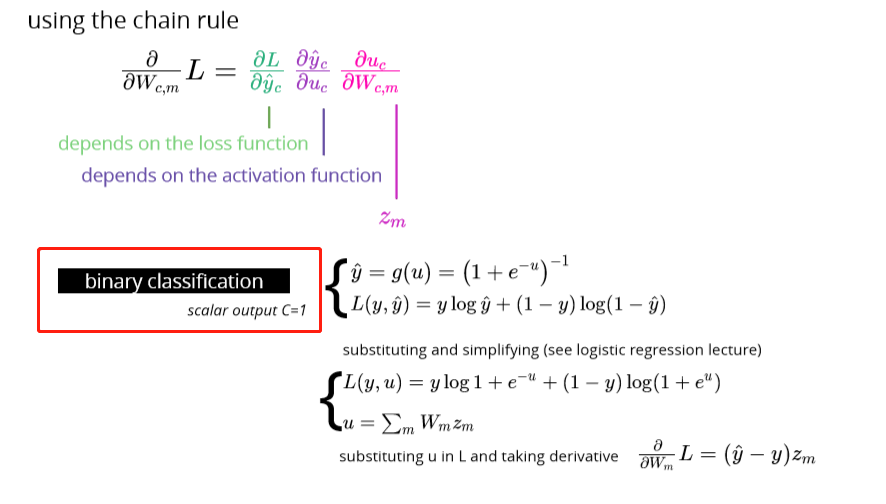

### For multiclass classification

Softmax: 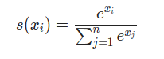

Code:

def softmax\( u, \# N x K \): u\_exp = np.exp\(u - np.max\(u, 1\)\[:, None\]\)

return u\_exp / np.sum\(u\_exp, axis=-1\)\[:, None\]

xs = np.array\(\[-1, 0, 3, 5\]\)

print\(softmax\(xs\)\) \# \[0.0021657, 0.00588697, 0.11824302, 0.87370431\]

Cross entropy: 

def cross\_entropy\(p, q\):

 return -sum\(\[p\[i\]\*log2\(q\[i\]\) for i in range\(len\(p\)\)\]\)

### Example:

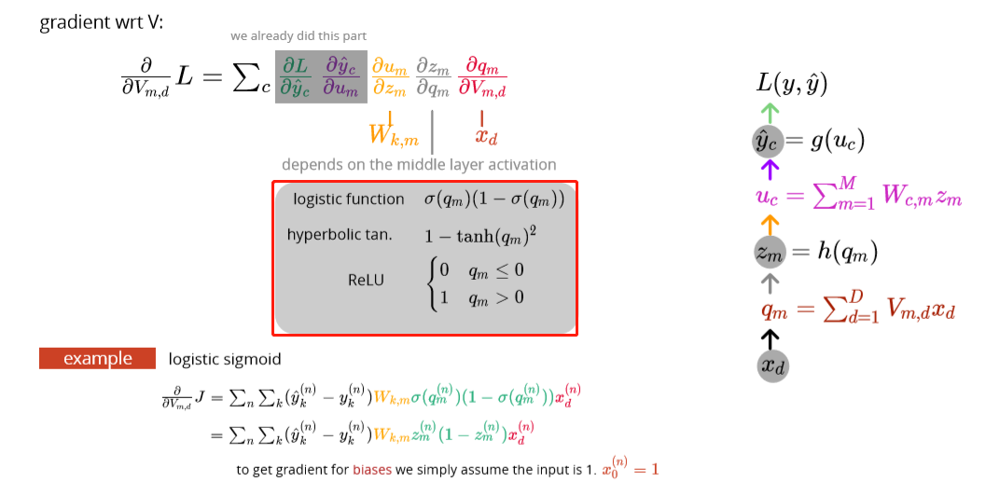

Codes:

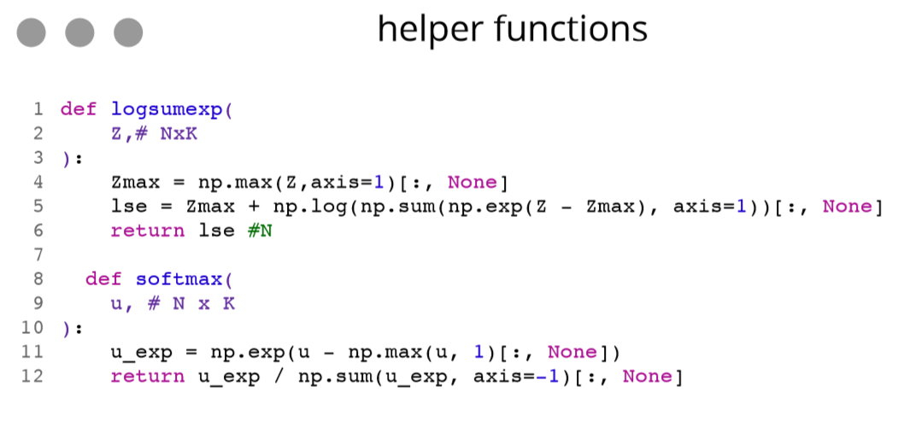

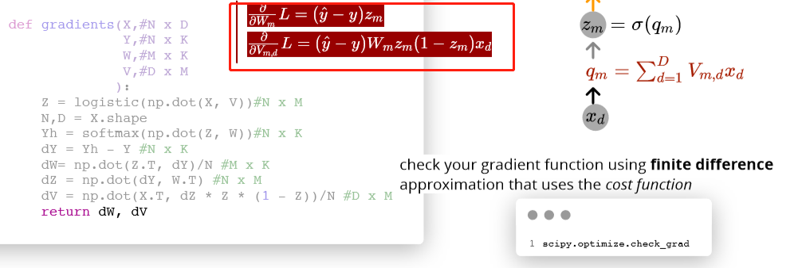

## Automating gradient computation

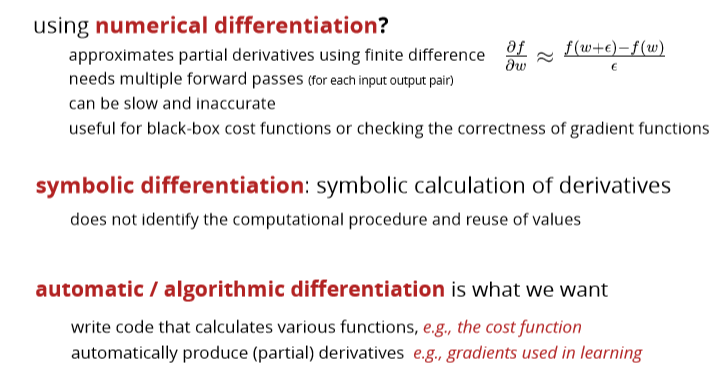

## Automatic differentiation

## Backpropagation

## Forward mode

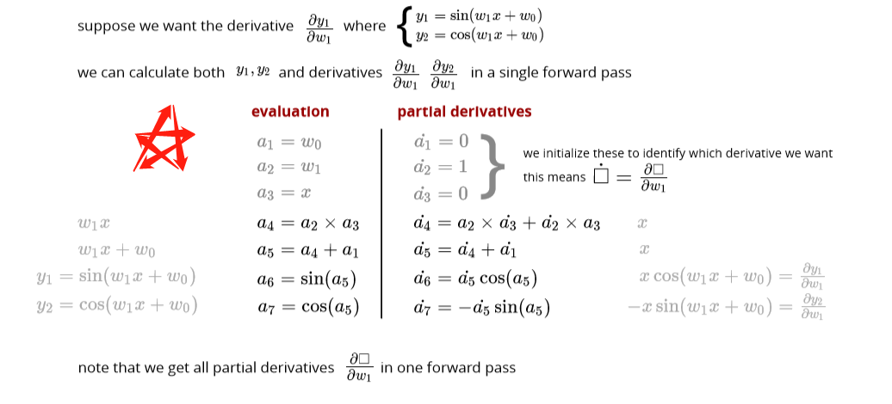

### Computational graph

## Reverse mode

### Computational graph

## Forward vs Reverse mode

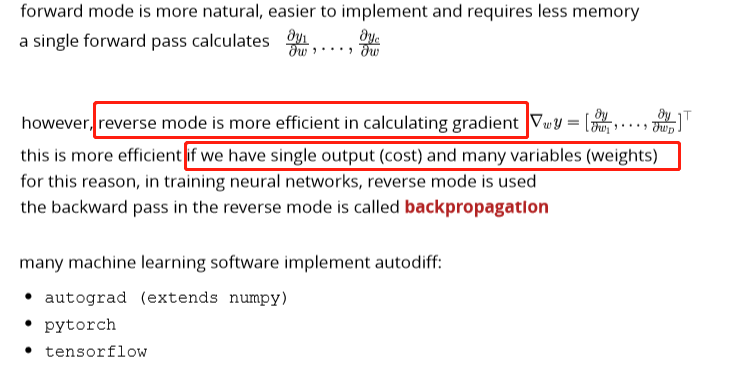

## Summary

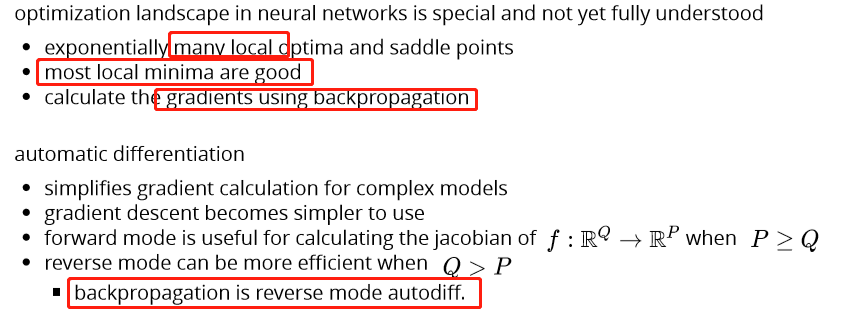

