# Gradient Descent

## Optimization in ML

## Gradient

Partial derivate 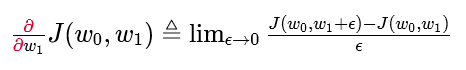

## Gradient descent

Iterative algorithm for optimization

## Convex function

### Definition

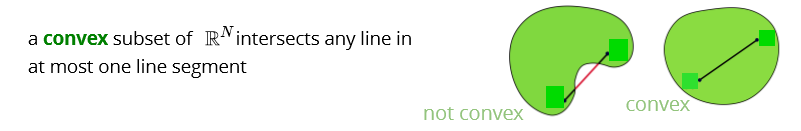

Any two points can be connected by at most one line

### Why convex?

Convex is easier to minimize:

* Critical pts are the global minimum
* Gradient descent can find it 

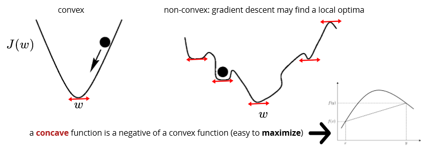

Concave function

## Recognizing convex functions

## Gradient for linear and logistic

## 

Partial derivative w.r.t m

### Time complexity

### Codes

Example: 

### Learning rate alpha

Learning rate has a significant effect on GD

* **too small**: may take a long time to converge
* **too large**: it overshoots

## Stochastic gradient descent

Use average \(expected value\)

| **Batch gradient update** | **Stochastic gradient update** |
| :--- | :--- |
| With small learning rate: **guaranteed** improved at each step | The **steps** are “on average” in the right direction |
|  |  |
| computes the gradient using the **whole dataset** | Stochastic gradient descent \(SGD\) computes the gradient using a **single sample**. Most applications of SGD actually use a **minibatch** of several samples |
| Slower | Faster |
| Directly towards an optimum solution, either local or global | SGD works well for error manifolds that have **lots of local maxima/minima**. In this case, the somewhat noisier gradient calculated using the reduced number of samples tends to jerk the model out of local minima into a region that hopefully is more optimal. |
|  | 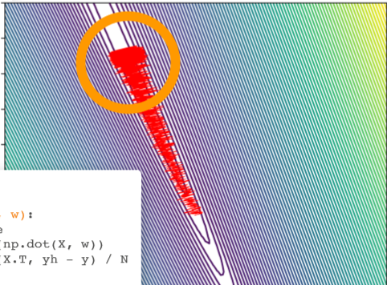 |
| [https://stats.stackexchange.com/questions/49528/batch-gradient-descent-versus-stochastic-gradient-descent](https://stats.stackexchange.com/questions/49528/batch-gradient-descent-versus-stochastic-gradient-descent) |  |

### Convergence of SGD

Grdients will not reach 0 at optimum, how to guarantee convergence: **schedule** to have a smaller learning rate over time: learning rate is getting smaller while iterating.

## Minibatch SGD

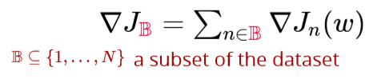

### Codes

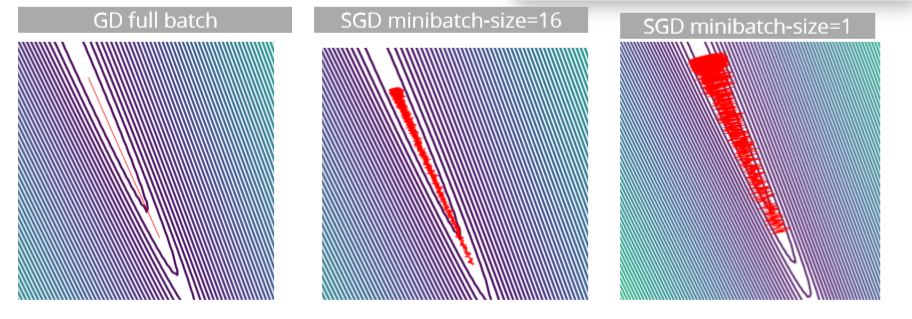

## Momentum

收窄SGD振幅：

* use a running average of gradients
* more recent gradients should have higher weights

Average moving:

### Codes

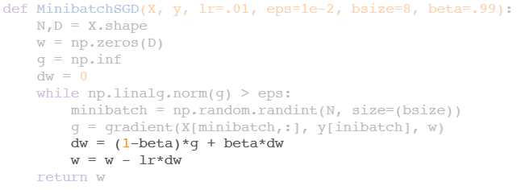

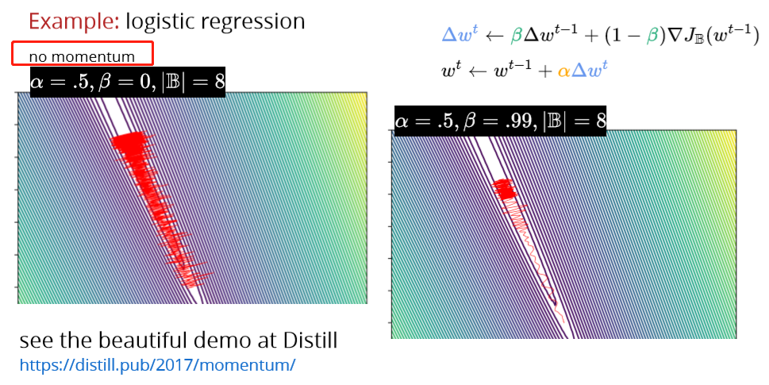

## Adagrad \(Adaptive gradient\)

* use different learning rate for each parameter
* make the learning rate adaptive

useful when parameters are updated at different rates \(e.g., NLP\)

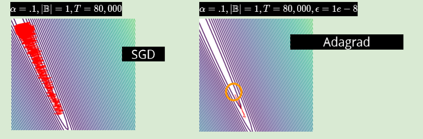

**problem: the learning rate goes to zero too quickly**

## RMSprop \(Root Mean Squared Propagation\)

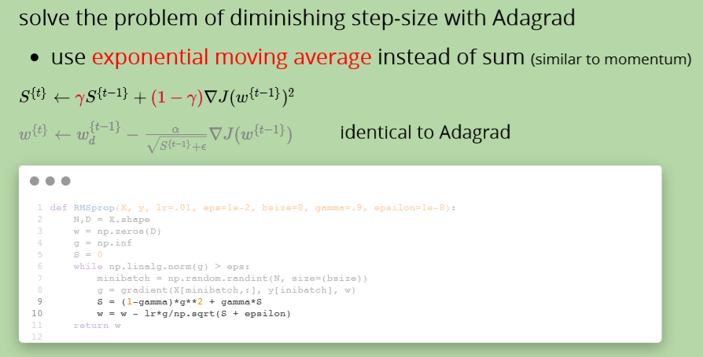

## Adam \(Adaptive Moment Estimation\)

two ideas so far:

1. use momentum to smooth out the oscillations

2. adaptive per-parameter learning rate

both use exponential moving averages

The authors propose default values of 0.9 for β1

, 0.999 for β2, and 10^−8 for ϵ.

## Adding L2 Regularization

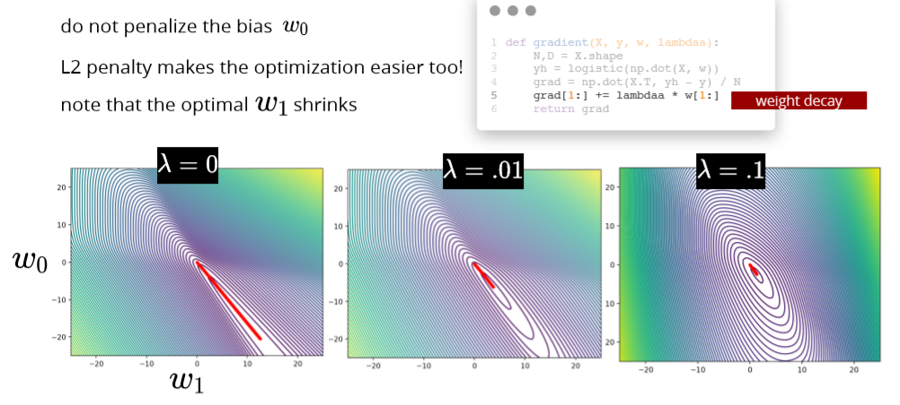

## Adding L1 Regularization

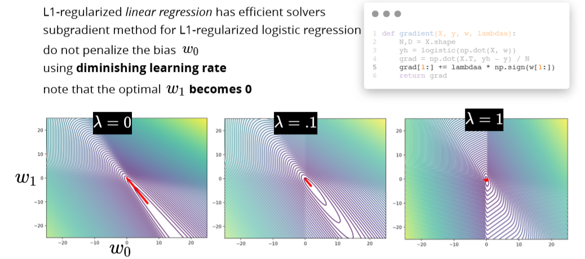

**Adding regularization can also help with optimization**

