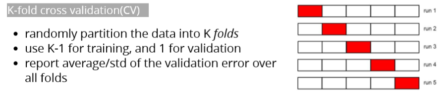
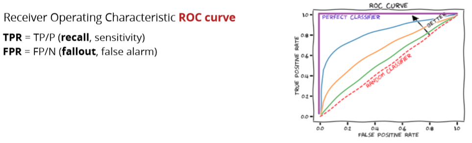
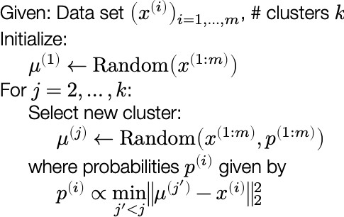

# K-means

## Algorithm

Hypothesis: 

Loss: 

Optimization method: Lloyd's algorithm

Optimization objective: minimize the average squared Euclidean distance of data from their cluster centers

**picture source: CMU Practical Data Science Fall 2019 lecture notes**

### Implementation details

initialization: k-means++: when initializing means, choose  sequentially, sampled with probability proportion to the minimum squared distance to all other centroids

Select K

### Elbow method

Calculate the Within-Cluster-Sum of Squared Errors \(WSS\) for different values of k, and choose the k for which WSS becomes first starts to diminish. In the plot of WSS-versus-k, this is visible as an elbow.

### Silhouette method

The silhouette value measures how similar a point is to its own cluster \(cohesion\) compared to other clusters \(separation\).

A high value is desirable and indicates that the point is placed in the correct cluster. Pick the k value with highest silhouette value

