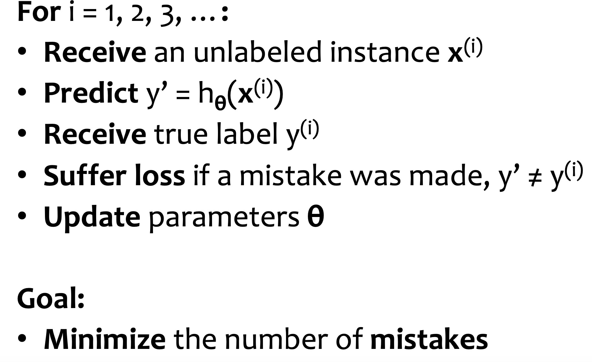
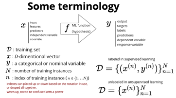

# ML Basics

## ML problem setting

### ML basic assumptions & definition

Probabilistic model: the dataset generating distribution of (input, output) pair, model gives high probability to reasonal (input, output) pairs. Here, we don't make any assumption about what distribution looks like.

Definition of ML:

.png>).png>).png>).png>)Given loss function and sample D from unkonwn distribution , compute a function that has low expected error over with respect to

Key assumption: target function unknown; candidate hypothesis approximate the target function

Model defines the hypothesis space over which learning performs its search

Model parameters are the numeric values or structure selected by the learning algorithm that give rise to a hypothesis

learning algorithm defines the data-drive search over the hypothesis space

hyperparameters are the tunable aspects of the model, that the learning algorithm does not select Inductive bias: the set the assumption that the learner uses to predict outputs given inputs that it has not encountered

Structure of ML alogrithm

Inputs (features): .png>)

.png>)Outputs:

Parameters: .

Hypothesis function:.png>).png>)

Loss function/objective function: Canonical optimization problem:

### Optimization (gradient descent)

Gradient descent: is a first-order iterative optimization algorithm for finding the minimum of a function. To find a local minimum of a function using gradient descent, one takes steps proportional to the negative of the gradient (or approximate gradient) of the function at the current point. (from wikipedia)

algorithm: simply repeatedly take small steps in the derivative of the negative partial derivatives, for each coordinate of our parameters.

Why?

Computational complexity of OLS closed form solution

There are situations where we can not find a closed-from solution Appendix: Big O for vector/matrix multiplication

Inner product :.png>).png>).png>)

Matrix-vector product Matrix-matrix product Matrix inverse :

Pros & Cons

Simple and often quite effective on ML tasks; often every scalable

only applies to differentiable functions; might find local minimum Details

starting points: random; zero stoping criterion

Step size

Stochastic GD: SGD reduce MSE much more rapidly than GD. Cannot implement vectorized implementation on it, slow down computations

Mini batch: calculate GD on batch of data points.

## Deterministic & probabilistic problems

### Deterministric function approximation vs. probabilistic learning

**picture source: CMU 10601 Spring 2019 lecture**

probabilistic learning: come up with some random variables and distribution such that the data is well-modeled by this distribution

### Generative vs. Discriminative models

Both models predicting .png>)

Generative: models the actual distribution of each class joint probability .png>)

assume features are conditional independent

.png>)Estimate parameters of directly from training data Use Bayes rule to calculate

example: Naive Bayes, GAN, HMM, Bayesian networks Discriminative: models the decisition bounday between classes

conditional probability .png>)

Example: logistic regression, Traditional neural networks G or D?

If model assumptions are correct, Naive Bayes perform better than logistic regression. If not, logistic regression does better

[https://medium.com/@mlengineer/generative-and-discriminative-models-af5637a66a3](https://medium.com/%40mlengineer/generative-and-discriminative-models-af5637a66a3)

### MLE vs MAP

MLE: pick parameters that maximize the probability of the observed data -

equivalent to maximum log of the function also called log-likelihood

Try to allocate as much probability mass as possible to the things we have observed at the expense of things we have not observed

MAP: choose the parameters that maximize the posterior of the parameters given the data:

MLE is a special case of MAP, where the prior is uniform

[Reference: https://wiseodd.github.io/techblog/2017/01/01/mle-vs-map/; https://towardsdatascience.com/mle-map- and-bayesian-inference-3407b2d6d4d9](https://towardsdatascience.com/mle-map-and-bayesian-inference-3407b2d6d4d9)

## Paramertric vs. nonparametric models

parametric models: have a fixed size of parameters

usually parametric modes assume a specific distribution that data follows

the complexity of the model is bounded even if the amount of data is unbounded

Examples: linear regression, logistic regression, linear SVM, k-means, hidden Markov models, PCA Nonparametric models: number of parameters grows with the size of the training set

No assumptions (or weak assumptions) about the underlying function. “distribution” or (quasi) assumption-free model, more flexbile Require more training data to estimate the mapping function.

Examples: K-nearest neighbor, decision trees, or RBF kernel SVMs, Gaussian processes

## Diagnose ML model

**This part brounght from CMU 15688 Fall 2019 lecture**

Characterizing bias vs. variance

Consider the training and testing loss of your algorithm (often plotting over different numbers of samples), to determine if you problem is one of high bias or high variance

For high bias, add features based upon your own intuition of how you solved the problem For high variance, add data or remove features (keeping features based upon your intuition)

Characterizing optimization performance

## Variance Bias Tradeoff

Bias

learner's tendency to consistently learn the same wrong thing Means how well the model fits the data

A high bias error means under-performance (underfit) model, which cannot be solved by adding more data

Fix high bias: get additionall features, decrese regularization parameter

Variance

learner's tendency to learn random things irrespective of real signal, lack of generalization ability means the magnitude of the change in the model based on the changes in the data (overfit)

Fix high variance: get more data, try smaller set of features, increase regularization parameter

## Overfitting vs. underfitting

Underfitting: simple model, unable to capture the trends in data, exhibit to much bias Overfitting: complex model, fit noise in the data, does not have enough bias

.png>) --> overfits

#### Cross-validation

A method of estimating loss and assessing model generaliztion ability on held out data.

Goal: prevent overfitting; select best hyperparameters; determine model high bias vs high variance

Methods: K-fold CV, leave-one-out CV, Stratified K-Fold Cross Validation, etc. After pick the best hyperparameters, learn the moel from the entire dataset

## Model selection vs. hyperparameter optimization

Model selection is the process by which we choose the best model from among a set of candidates

hyperparameter optimization is the process by which we choose the best hyperparameters from among a set of

candidates

Both assumes access to a function capable of measuing the quality of a model Both are typically done outsit the main training algorithm

## Ensemble

Ensemble is the art of combining diverse set of learners(Individual models) together to improvise on the stability and predictive power of the model.

Why ensemble: increase the stability of the final model and recude error

#### Bagging

Decrease model variance, reduce overfitting

Shorthand for the combination of bootstrapping and aggregating

#### Boosting

Decrease model bias

Train week learners sequentially, each trying to correct its predecessor

the generalization error of the boosting hypothesis is bounded by the distribution of margins observed on the training data.



#### Stacking

Increase the predictive force of classifier

a new model is trained from the combined predictions of two (or more) previous model

## Loss functions

#### loss functions for classification

least square: .png>) ; highly affected by outliers.png>)

Zero-one loss: .png>) ; difficult to optimize; non-smooth; least sensitive to outliers

Logistic loss: ; for large positive values, logistic lass will be close to 0, for large negative values, the loss increase approximately linearly, where y∈{−1,1}.png>).png>)

Hinge loss: .png>) .png>) Exponential loss:.png>).png>)

Cross entropy loss .png>) .png>).png>).png>)

**Picture source: CMU Practical Data Scienct Fall 2019 lecture notes**

loss function for regression

Mean square Error/ RMSE = .png>) Mean absolute error MAE

MAE vs. RMSE

Since the errors are squared before they are averaged, the RMSE gives a relatively high weight to large errors. This means the RMSE should be more useful when large errors are particularly undesirable.

MAE is steady and RMSE increases as the variance associated with the frequency distribution of error magnitudes also increases.

The RMSE result will always be larger or equal to the MAE. If all of the errors have the same magnitude, then RMSE=MAE.

From an interpretation standpoint, MAE is clearly the winner. RMSE does not describe average error alone and has other implications that are more difficult to tease out and understand.

[https://medium.com/human-in-a-machine-world/mae-and-rmse-which-metric-is-better-e60ac3bde13d](https://medium.com/human-in-a-machine-world/mae-and-rmse-which-metric-is-better-e60ac3bde13d)

#### loss function vs. MLE

A loss function is a measurement of model misfit as a function of the model parameters. Loss functions are more general than solely MLE.

MLE is a specific type of probability model estimation, where the loss function is the (log) likelihood. To paraphrase Matthew Drury's comment, MLE is one way to justify loss functions for probability models.

#### Batching learning vs. online learning

Batch learning: Learn from all the examples at once

Online learning: Gradually learn as each example is received (error driven) Example:

stock market prediction

Email classification (distribution of both spam and regular mail changes over time, but the target

function stays fixed - last year's spam still looks like spam) Recommendation system

Ad placement in a new market Algorithm

**picture source: CMU 10601 Spring 2019 lecture notes**

Confusion Matrix

picture source: [https://towardsdatascience.com/handling-imbalanced-datasets-in-machine-learning-7a0e84220f28](https://towardsdatascience.com/handling-imbalanced-datasets-in-machine-learning-7a0e84220f28)

|               | Predicted Positive | Predicted Negative |
| ------------- | ------------------ | ------------------ |
| True Positive | TP                 | FN                 |
| True Negative | FP                 | TN                 |

Accuracy .png>)

Recall/sensitivity/true positive rate: .png>) .png>) Sensitive to imbalanced data

How many positive cases has been correctly classified High recall indicated the class the correctly recognized

Precision .png>) .png>)

Sensitive to imbalanced data

Among all positive predicted cases, how many are correct

High precision indicated an example labled as positive is indeed positive

High recall, low precision: most of the positive examples are correctly recognized (low FN) but there are a lot of false positives. The class is well detected but the model also include points of other classes in it

Low recall, high precision: miss a lot of positive examples (high FN) but those we predict as positive are indeed positive (low FP). The model can’t detect the class well but is highly trustable when it does

F1 score .png>) , harmonic mean of precision and recall Specificity/true negative rate .png>)

Example of analyze FP and FN

When false positives are more important than false negatives:

In a non-contagious disease, where treatment delay doesn’t have any long-term consequences but the treatment itself is grueling

HIV test: psychological impact

When false negatives are more important than false positives:

If early treatment is important for good outcomes

In quality control: a defective item passes through the cracks Software testing: a test to catch a virus has failed

[Picture Source: https://blogs.oracle.com/oracledatacloud/busting-performance-claims-and-delivering-true-identity- graph-quality](https://blogs.oracle.com/oracledatacloud/busting-performance-claims-and-delivering-true-identity-graph-quality)

ROC/AUC

ROC/AUC: recall vs 1- specificity(FPR)

.png>) .png>)

Reference:[https://towardsdatascience.com/understanding-auc-roc-curve-68b2303cc9c5](https://towardsdatascience.com/understanding-auc-roc-curve-68b2303cc9c5)

ROC curve illustrates the performance of a binary classification model. The Area Under the Curve (AUC) signifieshow good the classifier model is. If the value for AUC is high (near 1), thenthe model is working satisfactorily, whereas if the value is low (around 0.5),then the model is not working properly and just guessing randomly.

Precision-recall curves

don't consider true negatives, should be used when specificity is of no concern of the classifier Pay attention to minority class

## PAC Learning

Stands for Probably Approximately Correct Learning, goal of PAC learning is to bound .png>) in terms of .png>)

## Measures

 &#x20;

Binary Classification

.png>)

## Terminology

.png>)

.png>)

.png>)

## Nearest Neighbor Classifier

**training**: do nothing

**test**: predict the lable by finding the closest image in the training set and need a measure of **distance**

.png>)

## K - nearest neighbors

**training**: do nothing (lazy learning)

**test**: predict the lable by finding the K closest instances

.png>)

.png>)

a non-parametric method: the number of model parameters **grows** with the data this is in contrast with a **parametric model** which has a **fixed** number of parameters, is faster to use but has stronger assumptions on the nature of the data distribution&#x20;

**KNN works well if input has low dimensions**

## Curse of Dimensionality

High dim are unintuitive

·         need exponentially more instances for K-NN to work (more data)

·         with same number of instances, the space becomes very sparse

·         **all samples have similar distances**

## Manifold Hypothesis

In the real-world, high-dim data lie close to the surface of a manifold (多支管)/low-dim

.png>)

## Model Selection

Example: KNN – k is the hyper-parameter, k up classification boundary smoother, training error increase; too small: overfit, too large: underfit

## Generalization

Generalization: performance of algorithm on unseen data

.png>)

## Hyperparameter Tuning

Training (used to train the model),

Testing (used to evaluate the final model),

Validation dataset (used to tune the hyperparameter).

Performance on validation set ≈ generalizationError

### K-folder cross validation CV

·         partition the data into k folds

·         use k-1 for training, and 1 for validation

·         average the validation error over all folds

.png>)

### Leave-one-out CV

Extreme case of k = N

## Inductive (归纳的) Bias

ML algorithms need to make assumptions about the problem

Every machine learning algorithm with any ability to generalize beyond the training data that it sees has some type of inductive bias, which are the assumptions made by the model to learn the target function and to generalize beyond training data.

For example, in linear regression, the model assumes that the output or dependent variable is related to independent variable linearly (in the weights). This is an inductive bias of the model.

inductive bias: strength and correctness of assumptions are important in having good performance

Examples:

·         manifold hypothesis in KNN (and many other methods)

·         close to linear dependencies in linear regression

·         conditional independence and causal structure in probabilistic graphical models

