# Multilayer Perceptron

## Adaptive Radial Base

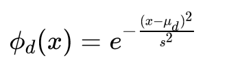

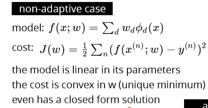

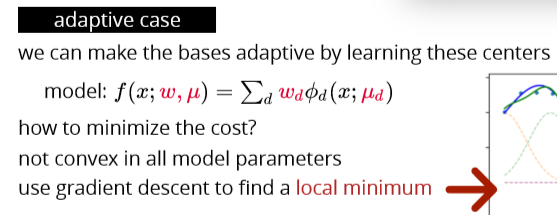

## Sigmoid Bases

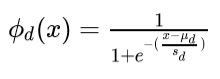

### Adaptive sigmoid bases

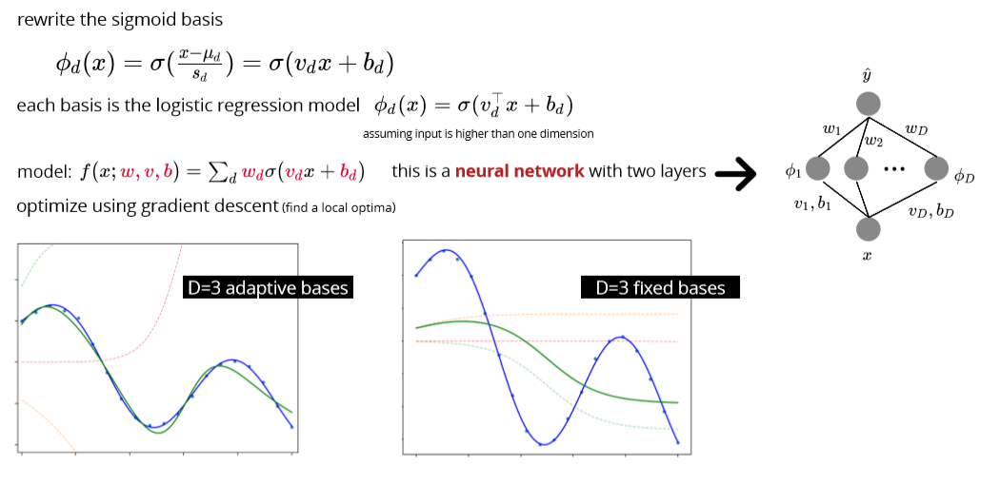

## Multilayer perceptron MLP

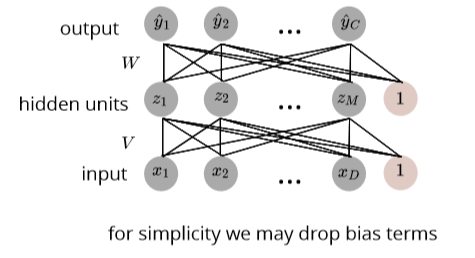

## Regression

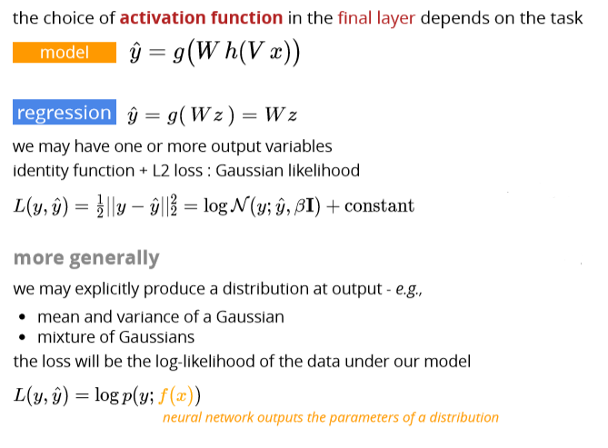

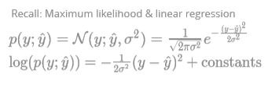

## Classification

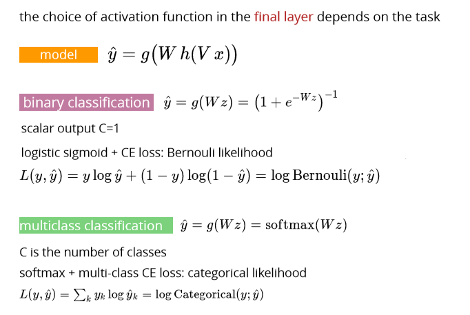

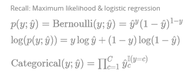

## !!! Activation function

### Logistic function

### Hyperbolic tangent

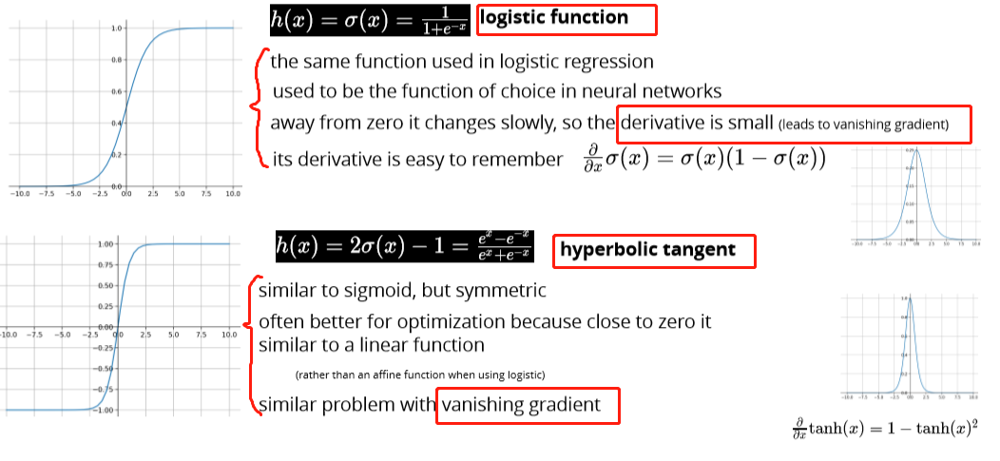

### ReLU

### Leaky ReLU

### Softplus

## Network architecture

Feedforward network aka multilayer perceptron

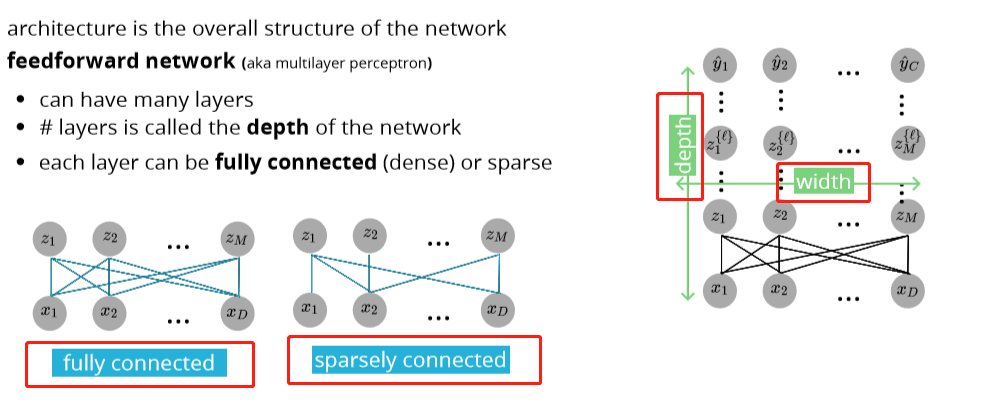

## Depth vs Width

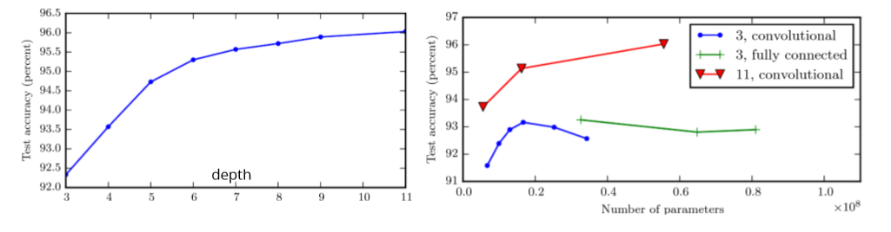

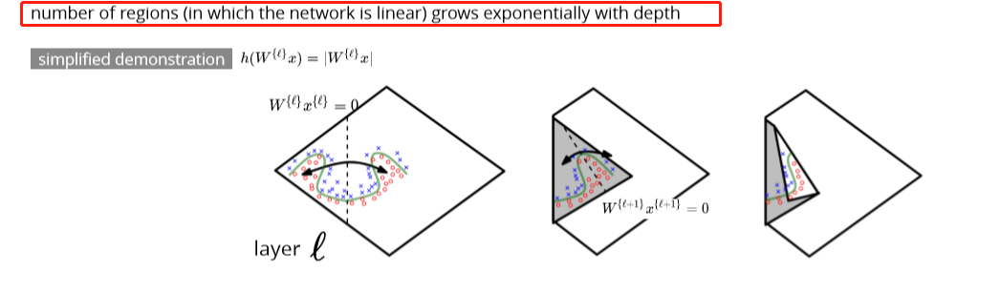

## Multilayer perceptron

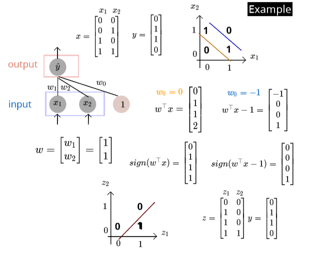

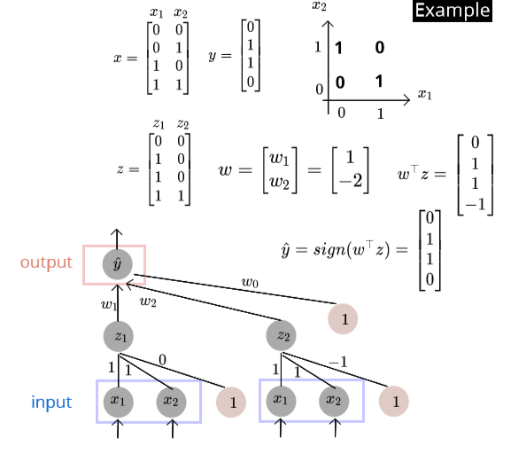

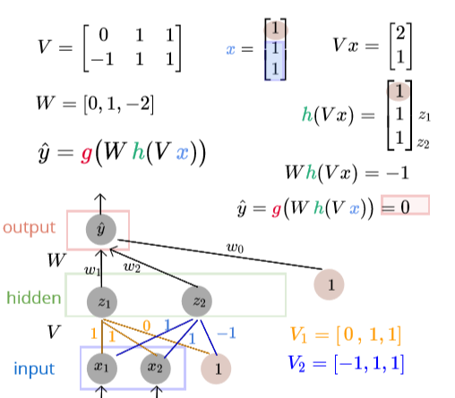

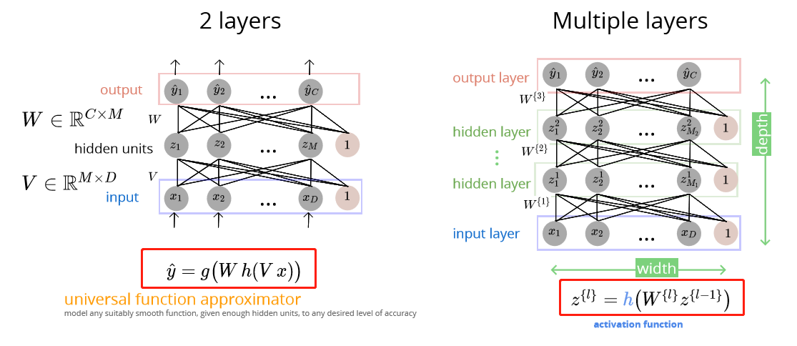

fully-connected: all outputs of one layer's units are input to all the next units

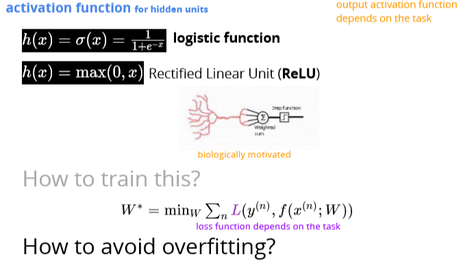

## Regularization strategies

### Overfit: variance reduction

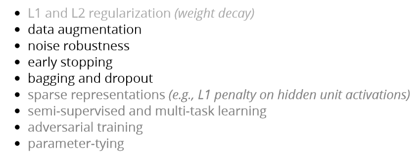

Data augmentation \(增大\)

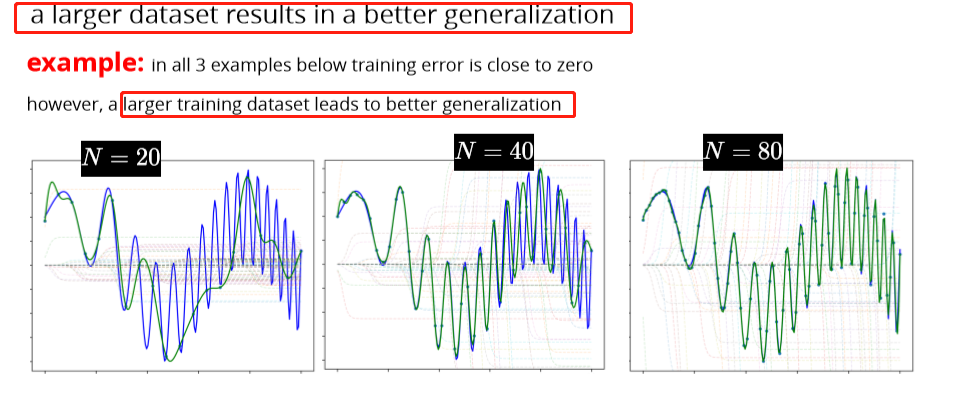

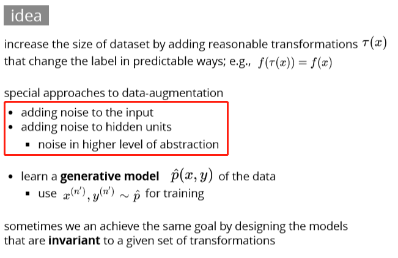

## Noise robustness

## Early stopping

## Bagging

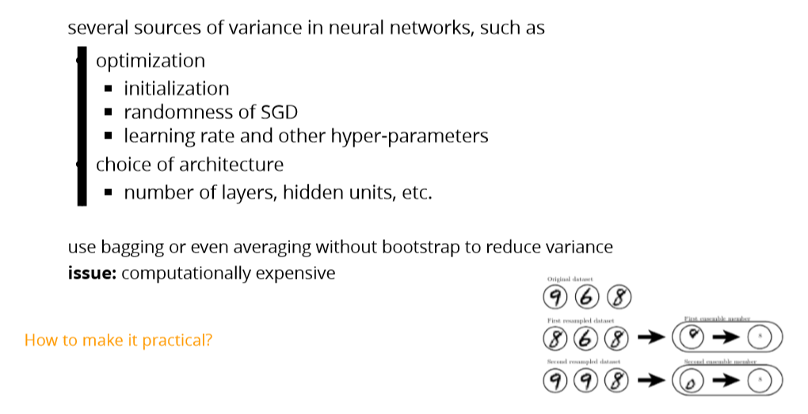

## Dropout

Let's start with **normal dropout**, i.e. dropout only at training time. Here dropout serves as a regularization to **avoid overfitting**. During test time, dropout is not applied; instead, all nodes/connections are present, but the weights are adjusted accordingly\(e.g. multiply the dropout ratio\). Such a model during test time can be understood as a average of an ensemble of neural networks.

Notice that for normal dropout, at test time the prediction is **deterministic**. _Without other source of randomness, given one test data point, the model will always predict the same label or value_.

For **Monte Carlo dropout**, the dropout is applied at both training and test time. At test time, the prediction is **no longer** **deterministic**, but depending on which nodes/links you randomly choose to keep. Therefore, _given a same datapoint, your model could predict different values each time._

So the primary goal of Monte Carlo dropout is to generate random predictions and **interpret them as samples from a probabilistic distribution**. In the authors' words, they call it Bayesian interpretation.

Example: suppose you trained an dog/cat image classifier with Monte Carlo dropout. If you feed a same image to the classifier again and again, the classifier may be predicting dog 70% of the times while predicting cat 30% of the time. Therefore you can interpret the result in a probabilistic way: with 70% probability, this image shows a dog.

## Summary

* Deep feed-forward networks learn adaptive bases
* more complex bases at higher layers
* increasing depth is often preferable to width
* various choices of activation function and architecture
* universal approximation power
* their expressive power often necessitates using regularization schemes

