# Perceptron & SVM

## Perceptron

### Objective

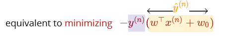

so perceptron tries to minimize the distance of misclassified points from the decision boundary and push them to the right side

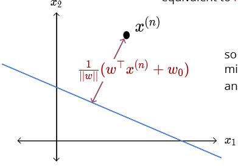

### Optimization

### Codes

Example

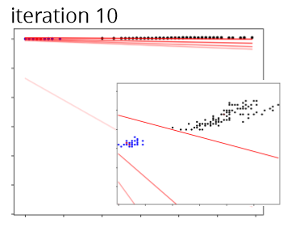

**observations**: after finding a linear separator no further updates happen; the final boundary depends on the order of instances \(different from all previous methods\)

### Issues

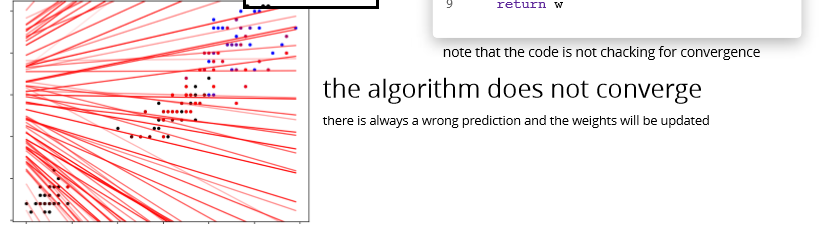

cyclic updates if the data is not linearly separable?

* try make the data separable using additional features?
* data may be inherently noisy

even if linearly separable convergence could take many iterations

the decision boundary may be suboptimal

## Margin

### Max margin classifier

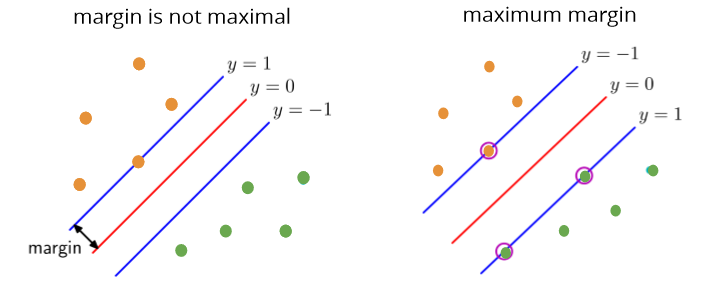

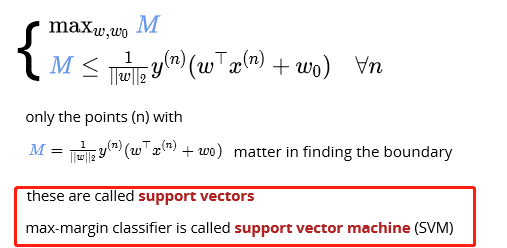

### Hard margin SVM objective

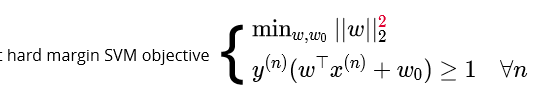

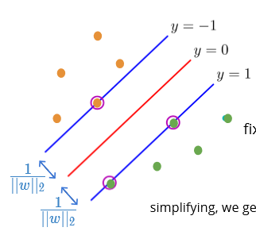 

### Soft margin SVM constraints

allow points inside the margin and on the wrong side but penalize them

 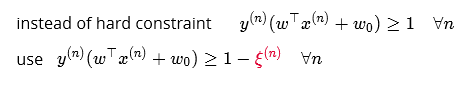

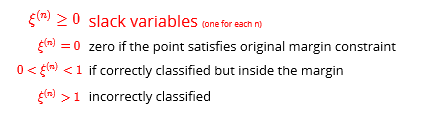

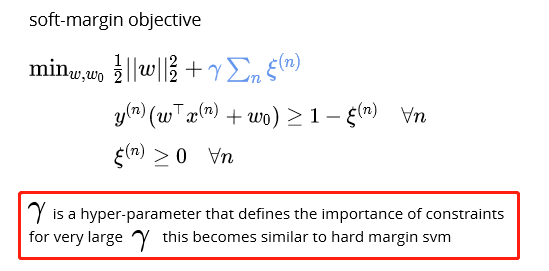

## Hinge loss

Why hinge loss:

We will punish the misclassified data points, which are located either inside the margin or wrong side of the margin, the margin is _distance from boundary._ If classify correctly, then no punishment.

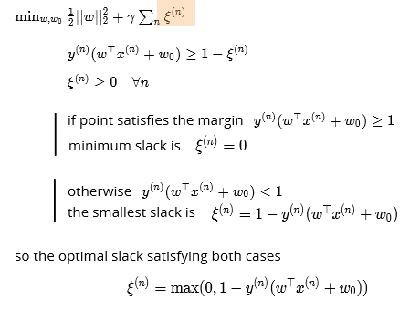

In hard margin SVM there are, by definition, no misclassifications

### Perceptron vs SVM

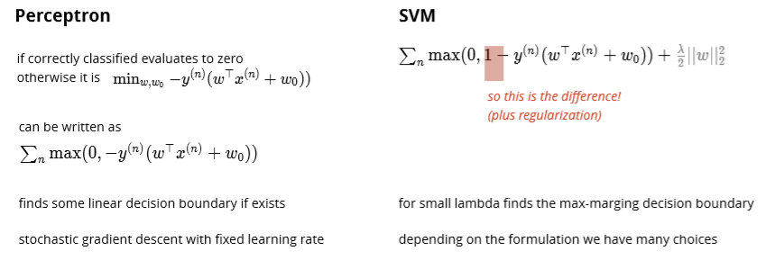

* The Perceptron does not try to optimize the separation "distance". As long as it finds a hyperplane that separates the two sets, it is good. SVM on the other hand tries to maximize the "support vector", i.e., the distance between two closest opposite sample points.
* The SVM typically tries to use a "kernel function" to project the sample points to high dimension space to make them linearly separable, while the perceptron assumes the sample points are linearly separable.

The major practical difference between a \(kernel\) perceptron and SVM is that **perceptrons can be trained online \(i.e. their weights can be updated as new examples arrive one at a time\)** whereas SVMs cannot be. See this question for information on whether SVMs can be trained online. So, even though a SVM is usually a better classifier, perceptrons can still be useful because they are cheap and easy to re-train in a situation in which fresh training data is constantly arriving.

### 

### SVM codes

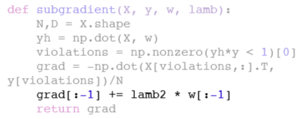

Hard SVM vs soft SVM vs Perceptron

## SVM recap

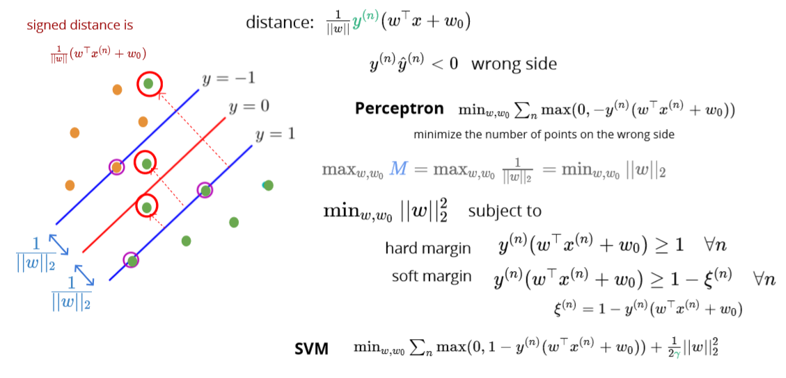

## SVM vs. logistic regression

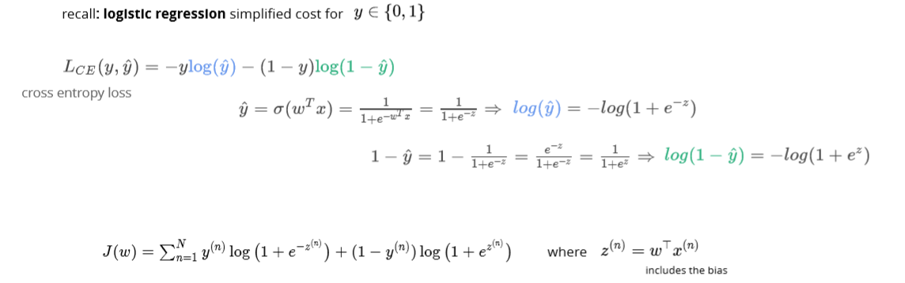

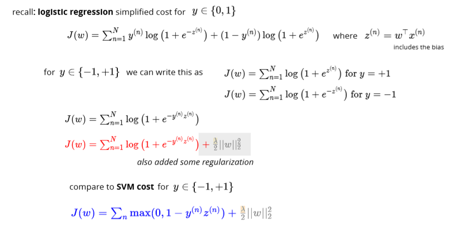

Multiclass classification

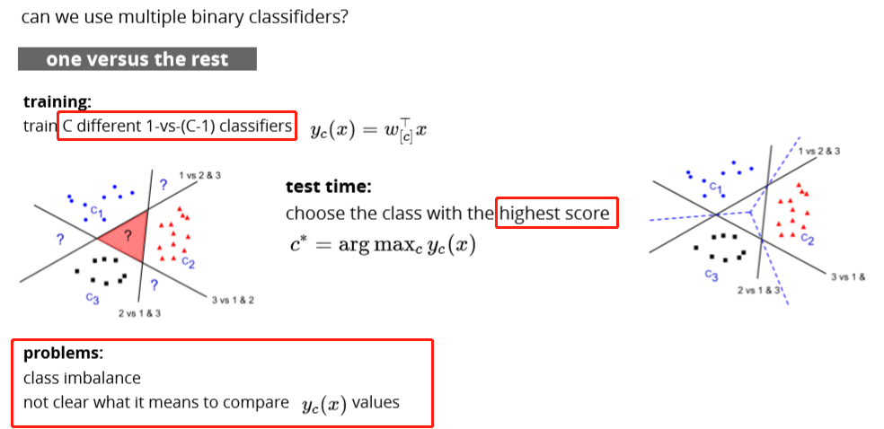

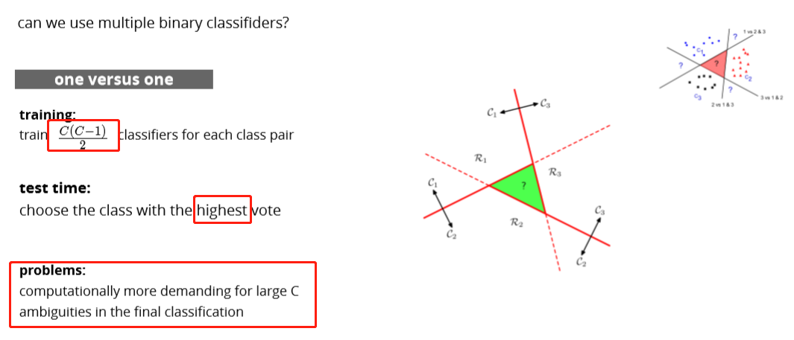

