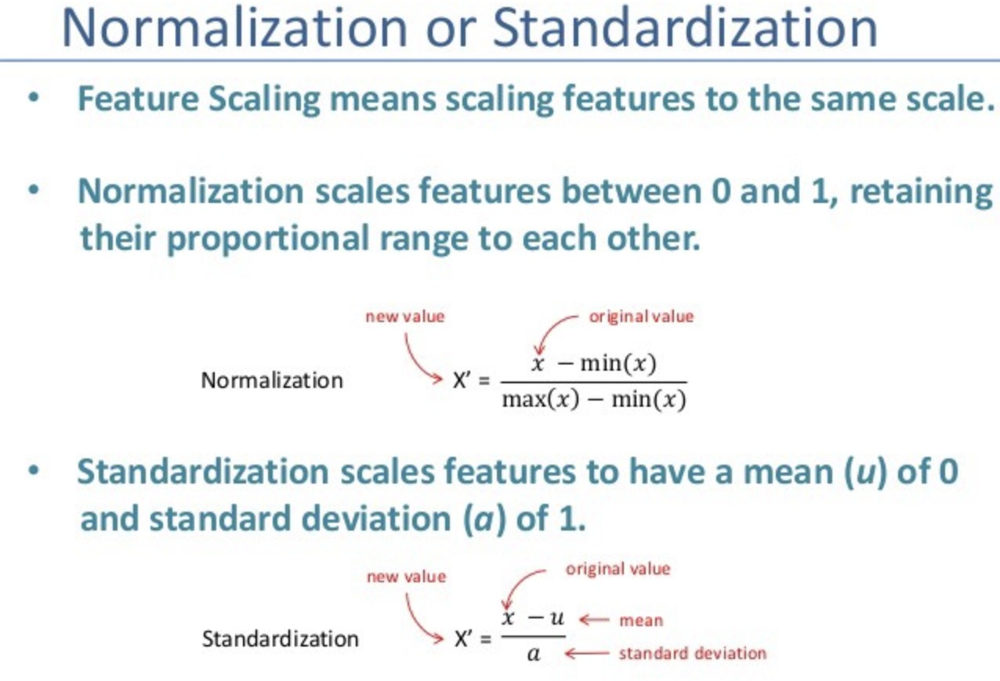
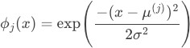
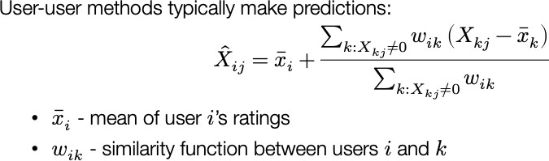
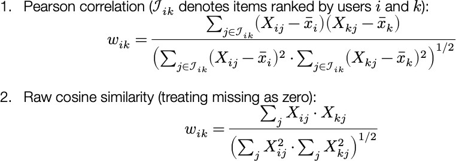
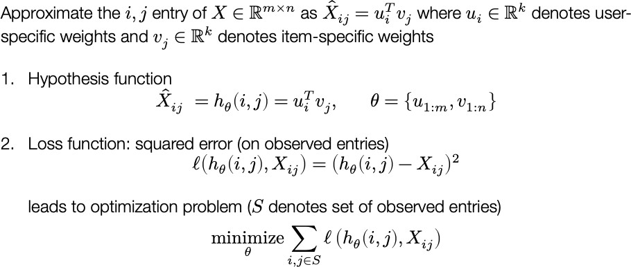
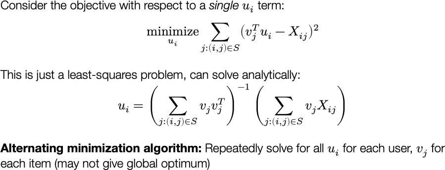
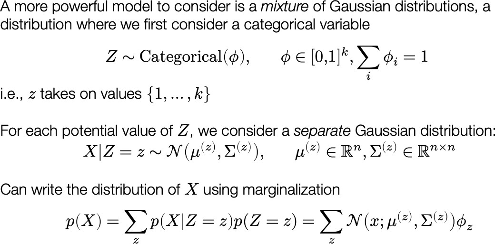
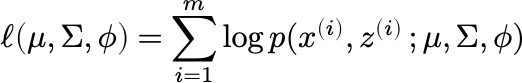
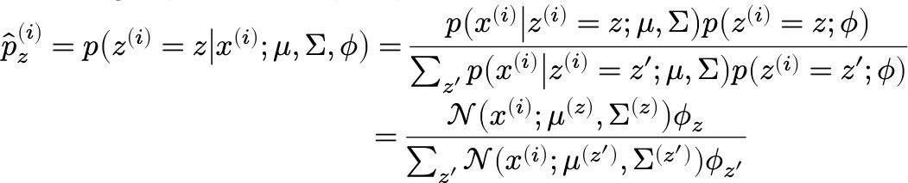
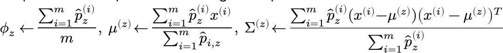

# Practical Data Science Techniques

## Prevent Overfitting

#### Cross validation (refer note in part1)

Regularization

Key idea: define .png>) s.t. we trade-off between fitting the data and keeping model simple, the regularization term penalize the magnitude of the coefficients

L1 regularization & L2 regularization

can be interpreted as MAP estimation of the parameters ridge regression need standardize variables

Don't regularize bias term. Because otherwise the learning algorithms wouldn't be invariant to a shift in the y- values

whitening data (subtract mean and divide by variance). For regularization, this helps all the features be penalized in the same units

[https://towardsdatascience.com/regularization-in-machine-learning-76441ddcf99a](https://towardsdatascience.com/regularization-in-machine-learning-76441ddcf99a)

#### Reduce dimension

PCA (linear dimensionality reduction)

t-SNE (nonlinear dimensinality reduction)

## Resampling

repeatedly drawing samples from a data set and refitting a given model on each sample with the goal of learning more about the fitted model.

Cross validation Bootstrap

## Define and evaluate metrics

1. regression vs. classification

Regression: MSE, MAE, WMAE, RMSLE, etc

Classification: accuracy, recall, AUC, precision, f1 score, misclassification rate, etc.

1. business goal

for classification problem, if the data is unbalanced, we need to consider what type of error we care more credit card fraud: we don't want to falsely classifed people as fraud -> low FPR

1. distribution of the target variable (imbalance?)
2. metric to optimize for

Example: detecting fraud - classification; want to make sure catch fraud transactions; imbalance dataset

### MAE OR RMSE

The main difference between MAE and RMSE is that RMSE is **more sensitive to outliers** and **large errors** than MAE. This is because RMSE squares the errors before averaging them, which gives more weight to larger errors. MAE, on the other hand, treats all errors equally and is more robust to outliers.

The choice of MAE or RMSE depends on the context and the goal of the analysis. If you want to **penalize large errors more and avoid occasional large mistakes in your predictions, then RMSE** might be a better option. However, if you want an error metric that is more interpretable and treats all errors equally, then MAE might be more suitable. You can also use both metrics to compare different models and see how they perform on different aspects of the data.

## Imbalanced dataset

Random undersampling and oversampling

Undersampling and oversampling using imbalanced-learn

imbalanced-learn( ) is a Python Package to tackle the curse of imbalanced datasets.

imblearn

Tomek links: pairs of examples of opposite classes in close vicinity. If we remove the majority element from the Tomke link, the decision boundary would be clearer

SMOTE: synthesize elements for the minority class

Class weights in the methods: specify weights for the minority class, it change the loss function Change evaluation metric: F1 score sort of maintains a balance betwee the precision and recall Other methods

Collect more data

treat the problem as anomaly detection, e.g. Isolation Forest, autoencoders Some model are particularly suited for imbalanced dataset, e.g. boosting models

[reference: https://towardsdatascience.com/the-5-most-useful-techniques-to-handle-imbalanced-datasets-6cdba0 96d55a](https://towardsdatascience.com/the-5-most-useful-techniques-to-handle-imbalanced-datasets-6cdba096d55a)

## Dealing w/ Outliers

i.e. how to make model robust to outliers?

### data based methods:

Drop

log-scale transformation (or other time or transfromation)

Winterizing: setting the extrem values of an attribute to some specified value

Bining: dividing a list of continuous variables into groups (also leads to loss of information and loss of power)

### model based methods:

Use models less impacted by outliers, e.g. tree-based methods like RF and GBM; SVM Use MAE instead of RMSE as a loss function, also can use truncated loss

[https://heartbeat.fritz.ai/how-to-make-your-machine-learning-models-robust-to-outliers-44d404067d07](https://heartbeat.fritz.ai/how-to-make-your-machine-learning-models-robust-to-outliers-44d404067d07)

## Compare ML lagorithm

### Single dataset

Statistical significance test

Step 1: using resampling methods (e.g. k-fold cross-validation) to generate model result pairs

Step 2: use t test to check if the difference in the accuracy/f1 socre is statistically significant (however, this violated the t test assumption, becuase k-fold CV results are correlated not independent)

Ways to solve the problem: resample independent data samples; Use McNemar's test; Use a Nonparametric Paired Test (makes few assumption, such as not assuming that the distribution of the skill scores is Gaussian.); use estimation statistics (confidence interval)

## Techniques to implement feature selection

(Why feature selection? reduce overfitting, improve accuracy, reduce training time)

Filter Method

use evaluation criteria from the intrinsic connections between features to score a feature subset correlation matrix (Pearson correlation)

correlation with output

correlation between input features distance metrics

Use interclass distance/intraclass distance mutual information

More general than correlation coefficient

quantifies the “the amount of information” obtained about one feature through the other feature consistency metrics

Chi-square: between feature and target. if features are independent to target are uninformative remove variables with low variance

result more general than wrapper method because it's independent to model

Wrapper Method

filtering dataset using a machine learning model as evaluation criteria; Feed some features to ML models, evaluate performance and decide if add or remove the feature to imporve accuracy

Exhaustive search: numberate all possible combinations

RFE: input ML model and # desired features; use sklearn.feature\_selection.RFE; combine with decision tree/random forest; find optimal combination

Heuristic search: sequential forward selection(SFS), sequential backward selection(SBS), greedy algorithms; bidirectional search use SFS and SBS

Forward selection:start from null model, then add features one by one; not guaranteed to give us the best model

Backrard selection: remove feature with the largest p-value Random search

SelectFromModel: sklearn method, can be used for all types of models; coef\_ and

feature\_importances\_ attribute; less robust than RFE

**more accurate than filtering but more computationally expensive**

Embedded Method

examine the different training iterations of ML model and then rank the importance of each feature based on how much each of the features contributed to the model training

LASSO regularization (L1)

coefficients of features get shrunken if not positively contributing to model training features get automatically discarded by assigning coefficients = 0

use feature importance plot

Ridge with L2 penalty also works

Elastic Net:

incorporate penalities from L1 and L2 regularization;

learning a sparse model where few of the weights are non-zero like Lasso and on the other hand maintaining the regularisation properties of Ridge.

Tree-based algorithms

Feature selection vs. dimensinality reduction

Featue selection is simply selecting and excluding given features without changing them. Diemnsionality reduction transfroms features into a lower dimension.

Reference:

[https://towardsdatascience.com/feature-selection-techniques-1bfab5fe0784](https://towardsdatascience.com/feature-selection-techniques-1bfab5fe0784); [https://medium.com/@cxu24/common-methods-for-feature-selection-you-should-know-2346847fdf31](https://medium.com/%40cxu24/common-methods-for-feature-selection-you-should-know-2346847fdf31); [https://analyticsindiamag.com/what-are-feature-selection-techniques-in-machine-learning/](https://analyticsindiamag.com/what-are-feature-selection-techniques-in-machine-learning/)

## Data Preprocessing

### Data cleaning

Check missing values

If small porition of missing value and the dataset is large, can simply drop them If not, impute missing values: mean, median, groupby

Check outliers

If you believe outliers might cause by data entry error, drop them

### Data Transformation

Normalization/Standardization (for some models)

picture source: [https://medium.com/datadriveninvestor/data-preprocessing-for-machine-learning-188e9eef1d2c](https://medium.com/datadriveninvestor/data-preprocessing-for-machine-learning-188e9eef1d2c)

Encode categorical variable

Feature Selection or dimension reduction

## Data normalization

can use box cox transformation to transform non-normal dependent variables into a normal shape.

Linear regression need normalize both input and output.

Actually, linear regression itself is insensitive to standardization, but in practice, we still want to normalize data because it can improves the numerical stability of your model

If not, converge will be slow. Because if two variables differ significantly in scale, we need different step size in two parameters. So we have to take extremely small steps that take a very long time to reach optimal value

If not, gradient descent might quick blowing up or run into underflow problem DT based algorithm: doesn't matter

Distance-based algorithm: need standardize

Nerual network: can conteract standardization but in practice data standardization is beneficial in terms of accuracy

[https://towardsdatascience.com/understand-data-normalization-in-machine-learning-8ff3062101f0](https://towardsdatascience.com/understand-data-normalization-in-machine-learning-8ff3062101f0)

## More features than more data points

overfitting

Least squares method can be unusable: no longer a unique least squares coefficient estimate

How to handle: regularization, use subeset of features, PCA reduce dimension, forward stepwise regression [https://medium.com/@jennifer.zzz/more-features-than-data-points-in-linear-regression-5bcabba6883e](https://medium.com/%40jennifer.zzz/more-features-than-data-points-in-linear-regression-5bcabba6883e)

## Encoding Categorical Features

Label Encoder

LabelEncoder converts each class under specified feature to a numerical value if multi-class, Label Encoder return different values for different categories

One Hot Encoder

For each class under a categorical feature, a new column is created for it. the output is a numpy array, not a dataframe

DictVectorizer

first transform dataframe to dict then use DictVectorizer return bumpy array

Get dummies

pd.get\_dummies()

Notes: Represent categorical features as one-hot encoding introduce multicollinearity problem, which would harm linear regression model. Therefore, we use dummy encoding (drop one variable after one-hot encoding) in linear regression.

[https://towardsdatascience.com/encoding-categorical-features-21a2651a065c](https://towardsdatascience.com/encoding-categorical-features-21a2651a065c) [https://towardsdatascience.com/one-hot-encoding-multicollinearity-and-the-dummy-variable-trap-b5840be3c41a](https://towardsdatascience.com/one-hot-encoding-multicollinearity-and-the-dummy-variable-trap-b5840be3c41a)

## Feature Engineering

Use domain knowledge

Non linear features: polynomial, radial basis function, sigmoid, log

RBF:

k-dimensional raw input, uniform grid with d centers over each dimension

generally local features: the value of any particular feature is close to zero for most of the input space, but non-zero in a small region around a “center” parameter.

Randomly chossing p data points or use k-means to find centers

use median trick to pick bandwidth , larger lead to smoother features functions, which in turns leads to smoother final functions

Kernel

motivation: need high dimensional representation but might be prohibitively expensive to compute Basic idea: rewrite the algorithm so thant we only work with dot product .png>) of feature vectors; then replace the dot product with a kernel function .png>)

Can be applied to: perceptron, SVM, ridge regression, k-means, etc.

Neural network

## Advanced modeling techniques

### Recommender system

Basic idea: make recommendation based on the preferances that other users have indicated for these item (collaborative filtering, most of entries unknown)

User-user/ item-item approaches: by correlation coefficient or cosine similarity

Similarity measures

Matrix factorization: find some low-rank decomposition of the X matrix that agrees at abserved values Algorithm:

Optimization method:

**All pictures of recommendation system come from CMU 15688 Practical Data Science Fall 2019 lecture notes**

### Anomaly detection

For supervised learning, anomalies are what some user labels as anomalies; for unsupervised view, anomalies are outliers (points of low probability) in the data

### K-Means

The underline assumption in the clustering based anomaly detection is that if we cluster the data, normal data will belong to clusters while anomalies will not belong to any clusters or belong to small clusters.

outliers\_fraction

use

our data set

Mixture Gaussian model

to provide information to the algorithm about the proportion of the outliers present in

Setting

Loss:

Optimizatio method: E(expection)M(maximization) E step:

M step:

### Isolation Forest

detects anomalies purely based on the fact that anomalies are data points that are few and different

Isolation Forest algorithm isolates observations by randomly selecting a feature and then randomly selecting a split value between the maximum and minimum values of the selected feature. Here an anomalous point could be separated in a few steps while normal points which are closer could take significantly more steps to be segregated.

[https://towardsdatascience.com/anomaly-detection-with-isolation-forest-visualization-23cd75c281e2](https://towardsdatascience.com/anomaly-detection-with-isolation-forest-visualization-23cd75c281e2)
