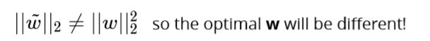
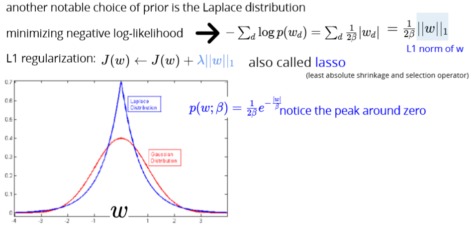
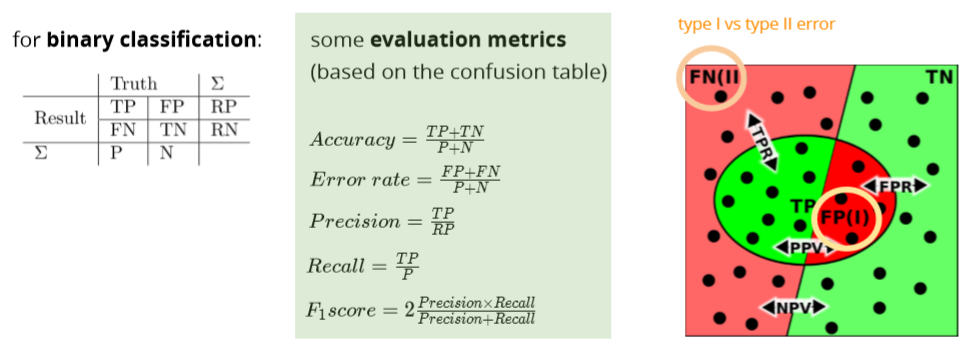

# Regularization

**Avoid overfitting**

**When overfitting, we often see large weights**

**!!! Idea: penalize large parameter values**

why: larger weight/parameter values usually indicate overfitting, because the model pay too much attention on some specific features, what we are trying to do is reduce/penalize the large parameter values, as long as the parameter values remain in a reasonable range, the model is no longer overfitting, same logic/idea for both linear and neural nets.&#x20;

Neural net regularization:&#x20;

* dropout: randomly deactivate some neurons in hidden layer
* batch normalization: normalize the batch of data based on its mean and standard deviation, which will lower the influence of some large values to the gradient update, so that the weight wouldn't be very large (pay too much attention)

**The main intuitive difference between the L1 and L2 regularization is that L1 regularization tries to estimate the median of the data while the L2 regularization tries to estimate the mean of the data to avoid overfitting**.

### Regularization in DL

by adding a parameter norm penalty Ω(θ) to the objective function J of the DL model



## How regularization work, L2 e.g.

.png>)

when $$\lambda$$ is very large, we penalize the weights and they become close to zero

.png>)

.png>)

why $$\lambda$$ is large, weight become close to zero:

.png>)

take the partial derivate of w (calculate gradient), and we can see that when **lambda is very large, w - lambda\*w will make the w close to zero**

## Why regularization work

During high bias, weights will be very small. During high variance, weights will be high. Similarly, during regularisation....if lambda is near infinity or high, our weights will tend to go down, because the function (gradient decent) will always try to minimize the overall value. If there's less lambda, weights will increase and model will try to fit each data point.......that also creates overfitting problems. So by tuning lambda in such a way that; both bias and variance should be in a acceptable range.

## Ridge regression

**L2 regularized** linear least squares regression:

Side note L2 norm:

* regularization parameter  λ > 0 controls the strength of regularization
* a good practice is to not penalize the intercept

## Ridge weight formula

## Ridge with data normalization

**Without regularization**: 

**With regularization**: 

Diff features will be penalized differently

**Instead of maximize log-likelihood, we maximize the posterior**

## Maximum a Posteriori (MAP)

## Gaussian prior

## Laplace prior

Lasso 

## L1 vs L2 regularization

## Diff regularization subset selection

optimizing this is a difficult combinatorial problem:

* search over all    2^D     subsets

## L1 VS L0

It’s just like LASSO but has a little difference. LASSO has a limit:

the L1 norm of the parameters < t (some constant threshold)

For L0 regularization. The constraint is the number of parameters < t (some constant threshold)

Most people never heard about it because LASSO is good enough in the cases that people want to punish some parameters to zero. L0 regularization shares the same function with it. **The difference is L0 is more extreme than L1. The parameters are much easier to be punished to zero.**

If you have 500 features in the pool and you want 10 of them left, you can try LASSO. However, if you have 10k features in the pool and you want 10 of them left, you probably want to try L0 regularization.

## Bias-variance decomposition

Larger regularization penalty -> high bias – low variance

high variance in more complex models means that test and training error can be very different

high bias in simplistic models means that training error can be high

## Cross validation

k-fold CV

leave-one-out CV:extreme case of k=N

Test data:

once the hyper-parameters are selected, we can use the whole set for training use test set for the **final** assessment

## Evaluation

ROC receiver operating characteristic

How to graph: [https://acutecaretesting.org/en/articles/roc-curves-what-are-they-and-how-are-they-used](https://acutecaretesting.org/en/articles/roc-curves-what-are-they-and-how-are-they-used)

##
