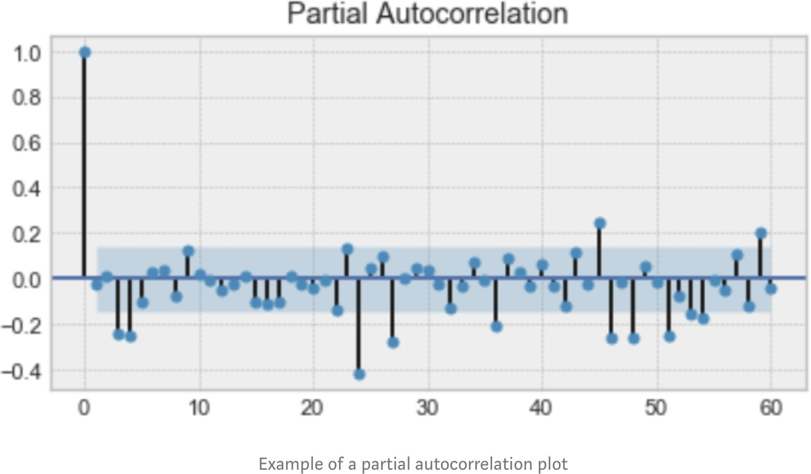

# Time Series Forecasting

## Basic Concept

Pattern/behavior of the data in a time series has several components that can be decomposed into: Trend

Accounts for the gradual shifting of the time series to relative higher or lower values over a long period of time

Usually the result of long-term factors, such as changes in the population.

## Common Pattern

### Cyclical

Any regular pattern of sequences of values above and below the treand line lasting more than on year(cycle not fixed)

Usually due to multiyear cyclical movements in the economy

### Seasonal

Accouts for regular patterns of variability within certain time periods

Irregular

### Autocorrelation

autocorrelation is the similarity between observations as a function of the time lag between them.

Above is an example of an autocorrelation plot. Looking closely, you realize that the first value and the 24th value have a high autocorrelation. Similarly, the 12th and 36th observations are highly correlated. This means that we will find a very similar value at every 24 unit of time.

### Seasonality

**Seasonality** refers to periodic fluctuations. For example, electricity consumption is high during the day and low during night, or online sales increase during Christmas before slowing down again.

.png>)

### Stationarity

A time series is said to be stationary if its **statistical properties do not change over time**. In other words, **it has constant mean and variance, and covariance is independent of time.**

.png>)

The mean and variance do not vary over time.

#### **Test if it is stationarity**

Dickey-Fuller test: null hypothesis is the process is not stationary

If it is, then _p > _0, and the process is not stationary.

Otherwise, _p = _0, the null hypothesis is rejected, and the process is considered to be stationary.

## Modeling Time Series

Last value method: Suitable for a time series that is so unstable that even the next-to-last value is not considered relevant for forecasting the next value.

Auto-regressive AR(p), where p is the number of earlier time steps to consider

Averaging method: Suitable for a very stable time series where even its first few values are considered relevant for forecasting the next value.

### Moving-average method

Suitable for a moderately stable time series where the last few values are considered relevant for forecasting the next value.

We can define a _window_ to apply the moving average model to _smooth_ the time series, and highlight different trends.

Of course, the longer the window, the _smoother _the trend will be. Below is an example of moving average on a smaller window.

.png>) .png>)

&#x20;

Moving average MA(q), where q is the window

### Exponential smoothing method

Suitable for a time series in the range from somewhat unstable to rather stable, where the value of the smoothing constant needs to be adjusted to fit the anticipated degree of stability.

similar to moving average but with a decreasing weight

.png>) , where is the smoothing factor.png>).png>)

.png>)

### Double exponential smoothing

used when there is a trend in the time series

.png>).png>).png>), where .png>) is the trend smoothing.png>).png>).png>).png>).png>).png>).png>)

factor

.png>)

### Tripe exponential smoothing

This method extends double exponential smoothing, by adding a **seasonal smoothing factor**. Of course, this is useful if you notice seasonality in your time series.

Integrated model: predicting difference between current and last steps, taken d times

### SARIMA

Applied when data shows evidence of non-stationarity

SARIMA = Seasonal Auto-Regressive Integrated Moving Average

Auto-Regressive AR(p): Variable of interest is regressed on its own lagged (prior) values

Moving Average MA(q): Regression error is linear combination of past and present errors Integrated I(d): Original data has been replaced by difference between current and previous terms Seasonality S(P, D, Q, s): s represent the season length

SARIMA parametrized by p, q, and d

p: number of time lags of the auto-regressive model

To find it, we look at the partial autocorrelation plot and identify the lag after which most lags are not significant.

In this case, p would 4

q: order of the moving average part

represents the biggest lag after which other lags are not significant on the autocorrelation plot.

q would be 4

d: degree of difference (number of times past values subtracted)

represents the number of differences required to make the series stationary. s: the season’s length

this component requires the parameters P and Q which are the same as p and q, but for the seasonal component.

D is the order of seasonal integration representing the number of differences required to remove seasonality from the series.

**before modelling with SARIMA, we must apply transformations to our time series to remove seasonality and any non-stationary behaviors.**

### Evaluation

Forecast error

Scale-dependent error: MAE & RMSE

percentage error: MAPE (mean average percentage error) scaled error: MASE (mean absolute average error)

Cross validation

[Reference: CMU 95851 Data Science for Product Manager Fall 2019 lecture; https://towardsdatascience.com/almost-](https://towardsdatascience.com/almost-everything-you-need-to-know-about-time-series-860241bdc578) [everything-you-need-to-know-about-time-series-860241bdc578; https://towardsdatascience.com/how-well-my-ti me-series-models-performed-actual-vs-prediction-r-1281fc66238e;](https://towardsdatascience.com/how-well-my-time-series-models-performed-actual-vs-prediction-r-1281fc66238e) [https://otexts.com/fpp2/accuracy.html](https://otexts.com/fpp2/accuracy.html)

[End-to-end sample: https://towardsdatascience.com/end-to-end-time-series-analysis-and-modelling-8c34f09a301 4](https://towardsdatascience.com/end-to-end-time-series-analysis-and-modelling-8c34f09a3014)
