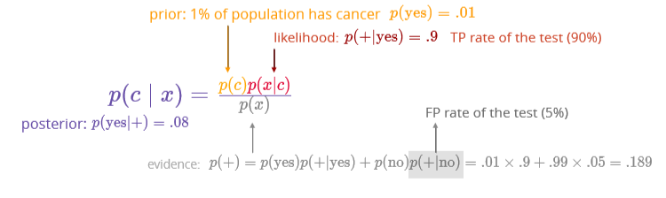
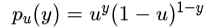
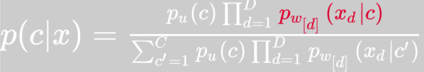
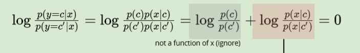
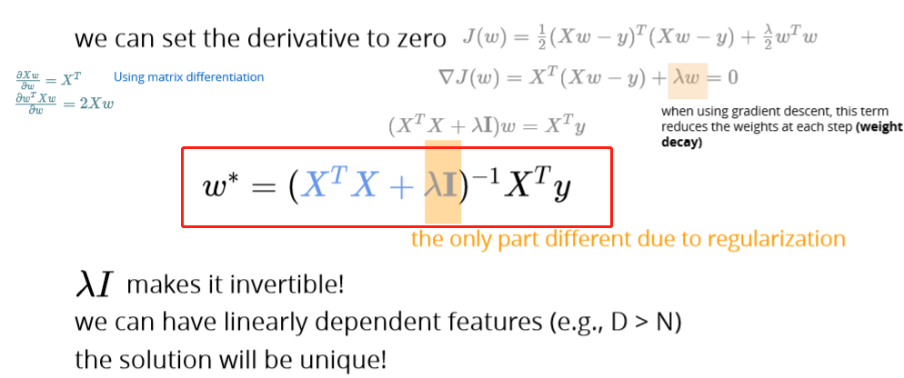
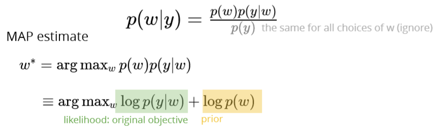
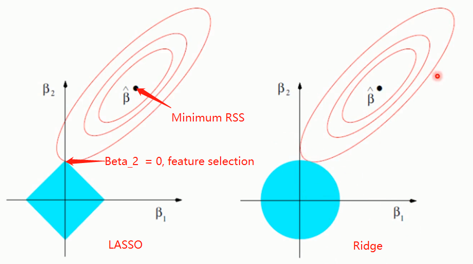

# Supplemental Notes

## Machine Learning Algorithm

### 

### Decision Tree

Why we love DT?

easy to explain and visualize

efficient in both computation and memory

can be applied to a wide variety of problems including classification, regression, density estimation, etc.

#### Algorithm

1. Search for the best attribute \(spliting criterion\) as node to split the data
2. Use value of split data into separate sets
3. Repeate step 1 and 2 on each set
4. Until stoping criteria satisfied
5. \(optional\) Prune tree if overfiting

Computational complexity: training -  ; predict: 

#### Spliting criterion

mutual information/information gain:  ; highest Error rate: lowest

Gini: 

#### Stoping critierion

spliting criterion &lt; threshold achieve maximum depth

Split is not statistically significant grow the entire tree, then prune

#### Pruning

Evaluate impact on validation set of pruning each possible node \(plus those below it\) Greedyliy remove the one that most improves validation set accuracy

Do until further pruning is harmful

#### Inductive Bias

ID3 \(greedy search\) prefer smallest tree that match data with high mutual information near top of the tree \(relatively small\)

#### Random Forest

RF is an emsemble \(bagging\) of decision trees. RF uses bagging and feature randomness when building each tree to try to create an uncorrelated forest of trees.

Ensemble methods, which combines several decision trees to produce better predictive performance than utilizing a single decision tree. The main principle behind the ensemble model is that a group of weak learners come together to form a strong learner.

Bagging is used when our goal is to reduce variance

Boosting is another ensemble technique to create a collection of predictors. In this technique, learners are learned sequentially with early learners fitting simple models to the data and then analyzing data for errors. In other words, we fit consecutive trees \(random sample\) and at every step, the goal is to solve for net error from the prior tree.

Reference: [https://towardsdatascience.com/decision-tree-ensembles-bagging-and-boosting-266a8ba60fd9](https://towardsdatascience.com/decision-tree-ensembles-bagging-and-boosting-266a8ba60fd9)

Feature importance is calculated as the decrease in node impurity weighted by the probability of reaching that node. The node probability can be calculated by the number of samples that reach the node, divided by the total number of samples.

Why RF?

The single decision tree is very sensitive to data variations\(high variance low bias\), which can easily overfit to noise in the data. RF can avoid.

RF can be trained in parallel

Quick prediction/trianing \(advantage of DT based models\) great with high dimensionallity with highly correlated features.

Handles missing values and maintains accuracy for missing data.

Robust to outliers and non-linear data: RF handles outliers by essentially binning them. Low bias and moderate variance

Generalization error for free: no CV needed, give a unbaised estimate

OOB \(Out-of-bag\) score

way of validating RF

use booststrap samples to train a DTs, then use out of bag samples to validate

each of the OOB sample rows is passed through every DT that did not contain the OOB sample row in its bootstrap training data and a majority prediction is voted for each row. The OOB score is computed as the number of correctly predicted rows from the out of bag sample.

OOB score vs. validation score:

validation score calculated using all DTs, OOB use subset of DTs

validation set validation dataset before training, OOB still use the OOB samples when training

OOB reduce the overall aggregation effect in bagging \(use only subset of DTs\). When dataset is not big enough, use OOB. Otherwise, use validation score.

Reference: [https://towardsdatascience.com/what-is-out-of-bag-oob-score-in-random-forest-a7fa23d710](https://towardsdatascience.com/what-is-out-of-bag-oob-score-in-random-forest-a7fa23d710)

Overfitting

RF tend to overfit as you add more trees

Tuning hyperparameters \(obtained by cross validation\): \# of trees \(higher number of trees will only reduce variance not bias\), \# attributes, depth of tree

Real world application

The most prominent application of random forest is _multi-class object detection_ in large-scale real-world computer vision problems. RF methods can handle a large amount of training data efficiently and are inherently suited for multi-class problems.

Another application is in bioinformatics, like medical diagnosis

#### Gradient Boosting Tree

An extension over boosting method. = gradient descent + boosting

Algorithm

1. A loss function to be optimized.

depends on problem to solve must be differentiable

1. A weak learner to make predictions.

Trees are constructed in a greedy manner, choosing the best split points based on purity scores like Gini or to minimize the loss.

constrain the weak learners in specific ways, such as a maximum number of layers, nodes, splits or leaf nodes. This is to ensure that the learners remain weak, but can still be constructed in a greedy manner.

1. An additive model to add weak learners to minimize the loss function.

After calculating the loss, to perform the gradient descent procedure, we must add a tree to the model that reduces the loss. We do this by parameterizing the tree, then modify the parameters of the tree to reduce the loss.

Pros & Cons

Pros

Supports different loss function.

Cons

Works well with interactions.

Boosting focuses step by step on difficult examples that give a nice strategy to deal with unbalanced datasets by strengthening the impact of the positive class.

It performs the optimization in function space \(rather than in parameter space\) which makes the use of custom loss functions much easier.

Prone to over-fitting Sensitive to noise

Requires careful tuning of different hyper-parameters Time-consuming, cannot run in parrallel

Improvement

Tree Constraints

It's important to keep the tree as a weak learner \(why?\)

number of trees, tree depth, \# of leaves, Number of observations per split, minimum loss improvement Shrinkage

contribution of each tree to this sum can be weighted to slow down the learning by the algorithm. Use learning rate shrinkage

Random sampling

use sampling to reduce the correlation between trees Resample data and features

GBT with random sampling also called Stochastic Gradient Boosting

Penalized Learning

Classical decision trees like CART are not used as weak learners, instead a modified form called a regression tree is used that has numeric values in the leaf nodes \(also called terminal nodes\). The values in the leaves of the trees can be called weights in some literature.

As such, the leaf weight values of the trees can be regularized using popular regularization functions, such as:

L1 regularization of weights. L2 regularization of weights.

Reference: [https://machinelearningmastery.com/gentle-introduction-gradient-boosting-algorithm-machine-learning/](https://machinelearningmastery.com/gentle-introduction-gradient-boosting-algorithm-machine-learning/)

[https://medium.com/@aravanshad/gradient-boosting-versus-random-forest-cfa3fa8f0d80](https://medium.com/%40aravanshad/gradient-boosting-versus-random-forest-cfa3fa8f0d80)

[https://towardsdatascience.com/machine-learning-part-18-boosting-algorithms-gradient-boosting-in-python-ef5ae 6965be4](https://towardsdatascience.com/machine-learning-part-18-boosting-algorithms-gradient-boosting-in-python-ef5ae6965be4)

Real world application

A great application of GBM is anomaly detection in supervised learning settings where data is often highly unbalanced such as DNA sequences, credit card transactions or cybersecurity.

XGBoost

XGBoost stands for eXtreme Gradient Boosting. We use XGBoost to improve speed and model performance.

Model Features

Three main forms of gradient boosting are supported:

Gradient Boosting algorithm also called gradient boosting machine including the learning rate. Stochastic Gradient Boostin with sub-sampling at the row, column and column per split levels. Regularized Gradient Boosting with both L1 and L2 regularization.

System Features

The library provides a system for use in a range of computing environments, not least:

Parallelization of tree construction using all of your CPU cores during training. Distributed Computing for training very large models using a cluster of machines. Out-of-Core Computing for very large datasets that don’t fit into memory.

Cache Optimization of data structures and algorithm to make best use of hardware.

#### RF vs. GBM

Since boosted trees are derived by optimizing an objective function, basically GBM can be used to solve almost all objective function that we can write gradient out. This including things like ranking and poission regression, which RF is harder to achieve.

GBMs are harder to tune than RF.

There are typically three parameters in GBM: number of trees, depth of trees and learning rate, and each tree built is generally shallow.

There are typically two parameters in RF: number of trees and number of features to be selected at each node.

RF not good at handling data imbalance while GBM can handle the problem nicely

Reference: [https://medium.com/@aravanshad/gradient-boosting-versus-random-forest-cfa3fa8f0d80](https://medium.com/%40aravanshad/gradient-boosting-versus-random-forest-cfa3fa8f0d80)

### KNN

#### Algorithm

Train: store data

Predict: Assign the most common label of the nearest point in computation complexity: training -  ; predict - 

K increase, model tend to overfiting; if K=N, majority vote

#### Distance functions

Euclidean distance\(most common\): Manhattan distance:

#### Break tie

Use different metris Increase K

Remove the farest one Weighted vote

#### Inductive bias

Nearby points should have similar label

All dimensions are created equally \(KNN suffers dimension curse, use all features equally\)

### Perceptron

Compare to DT \(use subset of features\) and KNN \(use all features equally\), perceptron learns weights for features.

#### Algorithm

initialize parameters to vector of all zeroes while not converged

receive next example predict

if ,

#### Perceptron mistake bound

If data has margin and all points inside a ball of radius , then Perceptron makes  mistakes.

Normalized margin: multiplying all points by 100, or dividing all points by 100, doesn’t change the number of mistakes; algo is invariant to scaling.

Assumption: finite size inputs & linearly separble data \(if not linearly separable, perceptron will not converge\)

#### Inductive bias

Decision boundary should be linear

prefer to correct most recent mistakes \(online learning\)

#### Interpretation

goal of update is to adjust the parameters so that they are better for current \(most recent\) example

In online learning, order of data matters

features with large absolute value of weights are most sensitive to make predictions \(need to scale feature before modeling\)

#### Extension

Voted Perceptron

generalizes better than \(standard\) perceptron

memory intensive \(keeps around every weight vector seen during training, so each one can vote\)

Averaged Perceptron

empirically similar performance to voted perceptron

can be implemented in a memory efficient way \(running averages are efficient\)

Kernel Perceptron

Choose a kernel 

Apply the kerne ltrick to Perceptron Resulting algorithm is still very simple

Structured Perceptron

Basic idea can also be applied when y ranges over an exponentially large set Mistake bound doesn't depend on the size of that set

### Linear Regression

**linear function: affine combination of variables**

Linear regression capture statistical relationship not deterministic relationship closed form solution:

Model evaluation: R-square. Indicated how much the variation in Y explained by model Null hypothese and P-value

Null hypothesis is the initial claim that researcher specify using previous research or knowledge. Low P-value: Rejects null hypothesis indicating that the predictor value is related to the response

Assumption:

Linear relationship

scatter plot between each independent variable and dependent variable Pearson correlation between each independent variable and dependent variable, df.corr\(dependent.var\)

multivariate normality \(residual are normally distributed\)

plotting a q-q plot to check

if not, t test cannot be applied for judging the significance of predictors No or little multicollinearity

if multicollinearity exists, coefficients estimates become every sensitive to small changes in the model

reduce the precision of the estimate coefficients, which weakens the power of regression model Homoscedasticity: variance of error term is the same across all values of independent variables

plotting the residuals against the values predicted by the regression model

if not met, it may be possible to transformthe outcome measure \(dependent variable\) Residual are statistically independent: data are random sample of population

Why need intercept term:

guarantees that the residuals have a zero mean

guarantees the least squares slopes estimates are unbiased

Data preparation

Linear Assumption. Linear regression assumes that the relationship between your input and output is linear. You may need to transform data to make the relationship linear \(e.g. log transform for an exponential relationship\). Remove Noise. Linear regression assumes that your input and output variables are not noisy. Consider using

data cleaning operations that let you better expose and clarify the signal in your data. This is most important for the output variable and you want to remove outliers in the output variable \(y\) if possible.

Remove Collinearity. Linear regression will over-fit your data when you have highly correlated input variables. Consider calculating pairwise correlations for your input data and removing the most correlated.

Gaussian Distributions. Linear regression will make more reliable predictions if your input and output variables have a Gaussian distribution. You may get some benefit using transforms \(e.g. log or BoxCox\) on you variables to make their distribution more Gaussian looking.

Rescale Inputs: Linear regression will often make more reliable predictions if you rescale input variables using standardization or normalization.

#### Model evaluation

R square/adjusted R square

F test: hypothese  : all regression coefficients are equal to zero RMSE

#### Variant

Lasso regression: where Ordinary Least Squares is modified to also minimize the absolute sum of the coefficients \(called L1 regularization\).

parameter shrinkage & variable selection automatically

Ridge regression: where Ordinary Least Squares is modified to also minimize the squared absolute sum of the coefficients \(called L2 regularization\).

doesn't zero out coefficients

L2 regularization tends to spread error among all the terms, while L1 is more binary/sparse, with many variables either being assigned a 1 or 0 in weighting. L1 corresponds to setting a Laplacean prior on the terms, while L2 corresponds to a Gaussian prior.

### Logistic regression

You can think of logistic regression as a special case of linear regression when the outcome variable is categorical, where we are using log of odds as dependent variable. In simple words, it predicts the probability of occurrence of an event by fitting data to a logit function.

Logistic Regression often referred as logit model is a technique to predict the binary outcome from a linear combination of predictor variables.

#### Basics

Bayes optimal classifer: classifier that minimized the error in a probabilistic manner. Maximum Likehood Estimation \(MLE\) to evaluation performance

Assumptions: categorical outputs; no outliers; no high correlations \(multicollinearity\) among the predictors; independent variables are linearly related to the log odds.

What are odds? What is odds ratio?

odds is the ratio of the probability of an event occurring tothe probability of the event not occurring. Odds ratio is the ratio of oddsbetween two groups. If odds ratio = 1, then there is no difference between

#### Algorithm

Hypotheis function:  , model the conditional probability  is the logistic model, outputs the logits

Loss function:

despite the fact that support vector machines and logistic regression are often framed in very different ways, both the formulations and results are quite similar here. The only difference between the two algorithms comes from their loss functions

hinge loss and logistic loss share similar properties in terms of the overall nature of the loss: they both approach zero for hθ\(x\)⋅y large positive \(hinge loss actually attains the zero value\), and they both are approximately linear for hθ\(x\)⋅y large negative. Not surprisingly, then, they both result in very similar \(though not exactly identical\) separating hyperplanes for particular problem.

Optimization: gradient descent

#### Interpretation

Intecept is the baseline. it's the log odds for an instance when all attributes are zero.

coefficient  the value by which the log odds change by a unit change in a particular attribute by keeping all other attributes fixed or unchanged \(control variables\).

Decision boundary is a line that separates the target variables

#### Multiclass logistic regression

Two multiclass classification methods:

one versus all method - create k different binary classifier; softmax loss/cross entropy loss

Model: 

Learning with MLE

reference: [https://towardsdatascience.com/logistic-regression-detailed-overview-46c4da4303bc](https://towardsdatascience.com/logistic-regression-detailed-overview-46c4da4303bc) [https://towardsdatascience.com/logistic-regression-for-dummies-a-detailed-explanation-9597f76edf46](https://towardsdatascience.com/logistic-regression-for-dummies-a-detailed-explanation-9597f76edf46)

### Neural Network

MLPs are universal function approximator with enough width and depth \(a single preceptron cannot compute XOR\)

#### Algorithm

Hypothesis: non-linear hypothesis function, which involve compositions of multiple linear operators \(e.g. matrix multiplications\) and elementwise nonlinear functions

Loss: classification: sigmoid, softmax; regression: MSE Optimization: gradient descent / SGD

Backpropagation: reuse computation from the forward pass and reuse partial derivatives throughout the backward pass. Make computation efficient.

#### Non-linear functions/activations

With activation functions, NN is a universal map from entire domain of input values to entire range of output activation. \(make nn differentiable\)

Tahn Sigmoid

ReLU / leaky ReLU

#### CNN

Why need convolutional layer

fully connected deep network require a huge number of parameters

don't capture the natrual invariance we expected in images \(location, scale\). In many problems, location of pattern is not important, only presence of pattern matters. Therefore, we need to scan for patterns.

Convolutional layer

Output size = \[\(N-M\)/S\] + 1, image size: N\*M, filter: M\*M, stride: S Also common to use 3D convolutions to combine multiple channels still linear layer

Poolling layer: max pooling, mean pooling

#### RNN

Why: we want a infinite response system to take infinite past into consideration

structure design: add hidden states into to NN. By unrolling the RNN through time, we can share parameters and acommodate arbitrary length input/output pairs

LSTM: combat issue of learning long distance dependencies

### Navie Bayes

Navies Bayes relies heavily on probabilistic modeling.

basic idea: model input and output as random variables to find 

Based on Bayes rule, the problem transformed to find  \(  \) Assumption: features are conditionally independent

Modeling full distribution for high-dimensional is not practical, so we’re going to make the naive

Bayes assumption, that the elements are conditionally independent given : 

#### Algorithm

Specify distribution for  and seperate distribution for each  Estimate parameters of distributions using MLE

We are actually using MAP here,  is the prior

Prediction: given data point , calculate probability of each class and take the maximum as predicted result

#### Implementation Details

Use log of probabilities to avoid underflow problem smoothing

To avoid zero divider problem, add smoothing term \(Laplace smoothing\)

### SVM

Intuitively, SVM is trying the find the classifier that maximize the margin. A good margin is one where this separation is larger for both the classes.

#### Algorithm

Hypothesis: linear

Loss: hinge loss + regularization term

Optimization: quadratic programming

Hyperparameters: regularization term. Gamma \(defines how far the influence of a single training example reached\)

[picture source: https://medium.com/machine-learning-101/chapter-2-svm-support-vector-machine-theory-f0812eff c72](https://medium.com/machine-learning-101/chapter-2-svm-support-vector-machine-theory-f0812effc72)

Comparison

SVM vs. perceptron

perceptron can be trained online, SVM can't

SVM looks at maximizing margin, perceptron reduce error \(pay attention to most recent data\)

SVM vs. logistic regression

different loss function

SVM try to maximize margin while LR has not this property LR is more sensitive to outliers than SVM

LR produce probabilistic values while SVM produce 1 or 0

SVM can use kernel function to capture non-linear decision boundary while logistic regression can't

[Kernel: https://towardsdatascience.com/understanding-support-vector-machine-part-2-kernel-trick-mercers-theore m-e1e6848c6c4d](https://towardsdatascience.com/understanding-support-vector-machine-part-2-kernel-trick-mercers-theorem-e1e6848c6c4d)

### 

### 

## Other Questions

### Your favoriate algo

Neural network/MLP Simple but power

Can apply a lot of techniques, e.g. batch normalization, drop out, which reflecting fundamental ideas behind machine learning.

It also changed our way of feature engineering

### Explain an Algo to a child

#### Neural network

Say your family goes out for a dinner to some restaurant, which serves some really good Soup, your family tastes it and loves it. On coming back home they tell you about the soup and you want to replicate the soup at your home. Now you start and you have 10 chances to come up with that soup, and you start preparing and every time you try the combination of recipe, you give it to your parents to taste it and start taking their feedback and make changes each time, and finally you come with that perfect Soup that you wanted to make, that’s it, your neural network is made. The ingredients that you used are the input to your neural networks, the weights of the neural network are analogous to the right quantity of salt, spice, temperature, duration etc., the 10 chances are your epochs or iterations, and the feedback that your parents\(poor guys who had to taste your soup all throughout\) give are the losses and if you are any good you would see that their feedback improves over time, if not buddy you got to stop and try something else.

source: [https://medium.com/datadriveninvestor/artificial-neural-networks-explained-to-5-year-old-5ceb532c11cc](https://medium.com/datadriveninvestor/artificial-neural-networks-explained-to-5-year-old-5ceb532c11cc)

Random forest

Let's say you got several very great candidates but you only have one headcount and you don't know how to pick. You have information about these candidates, like education backgroud, work experience, age, etc. You want to ask other colleages for help. So every time you ask a colleage for help, you just randomly pick 5 canditates and only tell them 5 features about these canditates to your colleage. Then you collect their choice. At end, you pick the candidate that most of your colleages had chosen.

#### Linear regression

Linear regression is a way of finding a relationship between a single, continuous variable called DV or Y and one or more other variables \(continuous or not\) called IV or X.

Imagine you are a owner of an ice cream shop. You want to know what's the relationship between the temperature and sales of ice cream. So you collect sales data and weather data from past two years. And you draw this data on paper and try to draw a line that looks like best capture the trend or the relationship between this two variables.

#### Logistic regression

Let's say you are in a supermarket and decide to buy an egg. You want to pick an egg. All you can do is weight the egg. Based on previous experience, you know that if you can get the weight of egg, you will know how likely this is a good egg. The logistic regression model take data input and make predictions in the same way.

#### Reinforcement learing

Reinforcement Learning is learning what to do and how to map situations to actions. The end result is to maximise the numerical reward signal. The learner is not told which action to take, but instead must discover which action will yield the maximum reward.Reinforcement learning is inspired by the learning of human beings, it is based on the reward/panelity mechanism.

#### PCA

Principal Components Analysis \(PCA\) is a technique that finds underlying variables \(known as principal components\) that best differentiate your data points.

A principal component can be expressed by one or more existing variables. For example, we may use a single variable

- vitamin C - to differentiate food items. Because vitamin C is present in vegetables but absent in meat, the resulting plot \(below, left\) will differentiate vegetables from meat, but meat items will clumped together.

To spread the meat items out, we can use fat content in addition to vitamin C levels, since fat is present in meat but absent in vegetables. However, fat and vitamin C levels are measured in different units. So to combine the two variables, we first have to normalize them, meaning to shift them onto a uniform standard scale, which would allow us to calculate a new variable - vitamin C minus fat. Combining the two variables helps to spread out both vegetable and meat items.

The spread can be further improved by adding fiber, of which vegetable items have varying levels. This new variable - \(vitamin C + fiber\) minus fat - achieves the best data spread yet.

[https://www.quora.com/What-is-an-intuitive-explanation-for-PCA](https://www.quora.com/What-is-an-intuitive-explanation-for-PCA)

