# Machine Learning ALL

ML Midterm Review

Contents

[Overview 4](broken-reference)

[Logistics 5](broken-reference)

[ML Basics 5](broken-reference)

[Measures 5](broken-reference)

[Terminology 5](broken-reference)

[Nearest Neighbor Classifier 5](broken-reference)

[K - nearest neighbors 5](broken-reference)

[Curse of Dimensionality 6](broken-reference)

[Manifold Hypothesis 6](broken-reference)

[Model Selection 6](broken-reference)

[Generalization 6](broken-reference)

[Hyperparameter Tuning 6](broken-reference)

[K-folder cross validation CV 6](broken-reference)

[Leave-one-out CV 6](broken-reference)

[Inductive (归纳的) Bias 6](broken-reference)

[Linear 7](broken-reference)

[Representing Data 7](broken-reference)

[Linear Model 7](broken-reference)

[Loss Function 7](broken-reference)

[Logistics 8](broken-reference)

[Solution 8](broken-reference)

[Logistic Regression Model: 8](broken-reference)

[Loss functions for linear classifier 8](broken-reference)

[Find the optimal weights 8](broken-reference)

[Gradient 8](broken-reference)

[Likelihood 9](broken-reference)

[Maximum likelihood & logistic regression 9](broken-reference)

[Maximum likelihood & linear regression 9](broken-reference)

[Multiclass classification 9](broken-reference)

[Softmax likelihood & one-hot encoding 9](broken-reference)

[Optimization 9](broken-reference)

[Gradient descent! 9](broken-reference)

[Naïve Bayes 10](broken-reference)

[Naïve bayes model 10](broken-reference)

[Max joint likelihood 10](broken-reference)

[Naïve bayes formula details: 10](broken-reference)

[Class prior 10](broken-reference)

[Likelihood 11](broken-reference)

[ 11](broken-reference)

[Binary features: Bernoulli NB 11](broken-reference)

[Multinomial features: 11](broken-reference)

[Gaussian features: 11](broken-reference)

[Decision Boundary 11](broken-reference)

[Discriminative vs Generative Classification 11](broken-reference)

[Regularization 11](broken-reference)

[Ridge regression 11](broken-reference)

[Ridge weight formula 12](broken-reference)

[Ridge with data normalization 12](broken-reference)

[Maximum a Posteriori (MAP) 12](broken-reference)

[Gaussian prior 12](broken-reference)

[Laplace prior 12](broken-reference)

[Lasso 12](broken-reference)

[L1 vs L2 regularization 12](broken-reference)

[Diff regularization subset selection 13](broken-reference)

[L1 VS L0 13](broken-reference)

[Bias-variance decomposition 13](broken-reference)

[Cross validation 13](broken-reference)

[Evaluation 14](broken-reference)

[Gradient Descent 14](broken-reference)

[Optimization in ML 14](broken-reference)

[Gradient 14](broken-reference)

[Gradient descent 14](broken-reference)

[Convex function 14](broken-reference)

[Definition 14](broken-reference)

[Why convex? 14](broken-reference)

[Recognizing convex functions 15](broken-reference)

[Gradient for linear and logistic 15](broken-reference)

[ 15](broken-reference)

[Time complexity 15](broken-reference)

[Codes 15](broken-reference)

[Learning rate alpha 15](broken-reference)

[Stochastic gradient descent 15](broken-reference)

[Convergence of SGD 16](broken-reference)

[Minibatch SGD 16](broken-reference)

[Codes 16](broken-reference)

[Momentum 16](broken-reference)

[Codes 17](broken-reference)

[Adagrad (Adaptive gradient) 17](broken-reference)

[RMSprop (Root Mean Squared Propagation) 17](broken-reference)

[Adam (Adaptive Moment Estimation) 17](broken-reference)

[Adding L2 Regularization 17](broken-reference)

[Adding L1 Regularization 18](broken-reference)

[Evaluation 18](broken-reference)

[Evaluation and comparison 18](broken-reference)

[Performance metrics for classification 18](broken-reference)

[Example precision recall 18](broken-reference)

[Less common metrics: 19](broken-reference)

[Performance metrics for multi-class classification 19](broken-reference)

[Trade-off between precision and recall ROC\&AUC 19](broken-reference)

[Cross validation in Evaluation 19](broken-reference)

[Over-fitting in Model Selection 19](broken-reference)

[Nested CV 19](broken-reference)

[Perceptron and Support Vector Machines 20](broken-reference)

[Perceptron 20](broken-reference)

[Objective 20](broken-reference)

[Optimization 20](broken-reference)

[Codes 20](broken-reference)

[Issues 20](broken-reference)

[Margin 20](broken-reference)

[Max margin classifier 21](broken-reference)

[Hard margin SVM objective 21](broken-reference)

[Soft margin SVM constraints 21](broken-reference)

[Hinge loss 21](broken-reference)

[Perceptron vs SVM 21](broken-reference)

[ 22](broken-reference)

[SVM codes 22](broken-reference)

[SVM recap 22](broken-reference)

[SVM vs. logistic regression 22](broken-reference)

[Decision Trees 23](broken-reference)

[Pros and cons 23](broken-reference)

[DT idea 23](broken-reference)

[Prediction per region 23](broken-reference)

[For regression: 23](broken-reference)

[For classification: 23](broken-reference)

[Feature types 23](broken-reference)

[Continuous: 23](broken-reference)

[Ordinal: 23](broken-reference)

[Categorical: 24](broken-reference)

[Cost Function 24](broken-reference)

[Regression cost 24](broken-reference)

[Classification cost 24](broken-reference)

[Search space 24](broken-reference)

[Greedy heuristic 24](broken-reference)

[Stopping the recursion 24](broken-reference)

[Entropy loss 25](broken-reference)

[Why? 25](broken-reference)

[Mutual information 25](broken-reference)

[Entropy for classification cost 25](broken-reference)

[Gini index – the way to split the tree 26](broken-reference)

[Overfitting 26](broken-reference)

[Pruning 26](broken-reference)

[Bootstrap, bagging, and boosting 26](broken-reference)

[Bootstrap 26](broken-reference)

[Codes 26](broken-reference)

[Bagging (Bootstrap aggregating) 27](broken-reference)

[Bagging for regression 27](broken-reference)

[Bagging for classification 27](broken-reference)

[Example 27](broken-reference)

[Random forests 27](broken-reference)

[Out of bag (OOB) samples 27](broken-reference)

[Summary 28](broken-reference)

[Adaptive bases 28](broken-reference)

[Optimization idea 28](broken-reference)

[Example 28](broken-reference)

[Exponential loss 29](broken-reference)

[AdaBoost algorithm 29](broken-reference)

[Discrete AdaBoost Algorithm Example 30](broken-reference)

[Example 30](broken-reference)

[Gradient boosting 30](broken-reference)

[Algorithm 30](broken-reference)

[Gradient tree boosting 31](broken-reference)

[Some loss functions for gradient boosting 31](broken-reference)

[!!!Boosting vs Bagging 31](broken-reference)

[Multilayer perceptron 33](broken-reference)

[Adaptive Radial Base 33](broken-reference)

[Sigmoid Bases 34](broken-reference)

[Adaptive sigmoid bases 34](broken-reference)

[Multilayer perceptron MLP 34](broken-reference)

[Regression 34](broken-reference)

[Classification 35](broken-reference)

[!!! Activation function 35](broken-reference)

[Logistic function 35](broken-reference)

[Hyperbolic tangent 35](broken-reference)

[ReLU 35](broken-reference)

[Leaky ReLU 35](broken-reference)

[Softplus 35](broken-reference)

[Network architecture 35](broken-reference)

[Depth vs Width 35](broken-reference)

[Multilayer perceptron 36](broken-reference)

[Regularization strategies 37](broken-reference)

[Overfit: variance reduction 37](broken-reference)

[Noise robustness 37](broken-reference)

[Early stopping 37](broken-reference)

[Bagging 37](broken-reference)

[Dropout 38](broken-reference)

[Summary 38](broken-reference)

[Gradient Computation & Automatic Differentiation 38](broken-reference)

[Landscape of the cost function 39](broken-reference)

[Jacobian matrix 39](broken-reference)

[Chain rule 39](broken-reference)

[Training a two layer MLP 39](broken-reference)

[Gradient calculation 39](broken-reference)

[For regression 39](broken-reference)

[For binary classification 39](broken-reference)

[For multiclass classification 40](broken-reference)

[Example: 40](broken-reference)

[Automating gradient computation 41](broken-reference)

[Automatic differentiation 41](broken-reference)

[Forward mode 41](broken-reference)

[Computational graph 41](broken-reference)

[Reverse mode 41](broken-reference)

[Computational graph 42](broken-reference)

[Forward vs Reverse mode 42](broken-reference)

[Summary 42](broken-reference)

[Backpropagation explain and resources 42](broken-reference)

Overview

Types:

Supervised learning: labeled data:

**Classification** (categorical output, discrete):

**Regression** (numerical output, continuous),

**Structured prediction**

Unsupervised learning: only unlabeled data

Clustering

Dimensionality reduction

Density estimation / generative modeling

Anomaly detection

Discovering latent factors and structures

## Logistics

ML Basics

## Measures

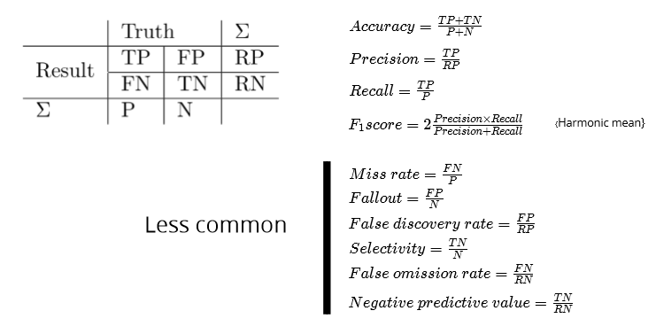 Binary Classification

## Terminology

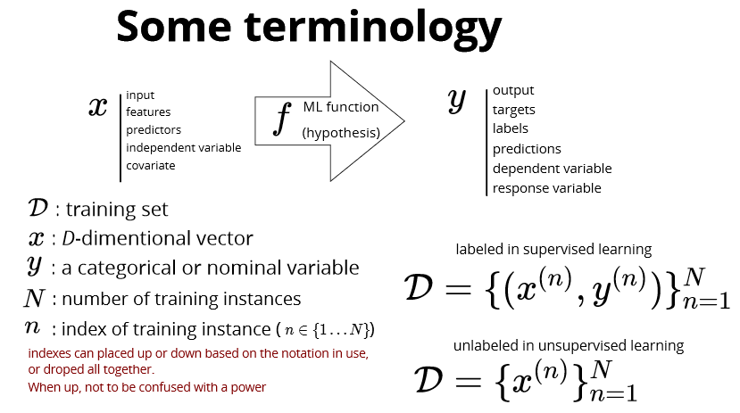

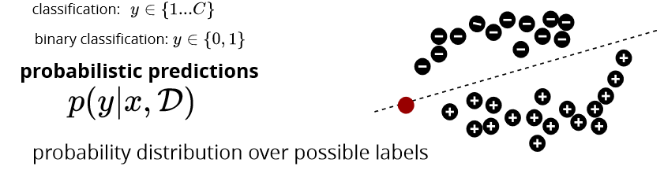

## Nearest Neighbor Classifier

**training**: do nothing

**test**: predict the lable by finding the closest image in the training set and need a measure of _**distance**_

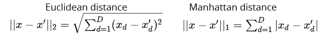

## K - nearest neighbors

**training**: do nothing (lazy learning)

**test**: predict the lable by finding the K closest instances

a non-parametric method: the number of model parameters **grows** with the data this is in contrast with a **parametric model** which has a **fixed** number of parameters, is faster to use but has stronger assumptions on the nature of the data distribution&#x20;

**KNN works well if input has low dimensions**

## Curse of Dimensionality

High dim are unintuitive

* need exponentially more instances for K-NN to work (more data)
* with same number of instances, the space becomes very sparse
* **all samples have similar distances**

## Manifold Hypothesis

In the real-world, high-dim data lie close to the surface of a manifold (多支管)/low-dim

## Model Selection

Example: KNN – k is the hyper-parameter, k up classification boundary smoother, training error increase; too small: overfit, too large: underfit

## Generalization

Generalization: performance of algorithm on unseen data

## Hyperparameter Tuning

Training (used to train the model),

Testing (used to evaluate the final model),

Validation dataset (used to tune the hyperparameter).

_Performance on validation set ≈ generalizationError_

### K-folder cross validation CV

* partition the data into k folds
* use k-1 for training, and 1 for validation
* average the validation error over all folds

### Leave-one-out CV

Extreme case of k = N

## Inductive (归纳的) Bias

ML algorithms need to make assumptions about the problem

inductive bias: strength and correctness of assumptions are important in having good performance

Examples:

* manifold hypothesis in KNN (and many other methods)
* close to linear dependencies in linear regression
* conditional independence and causal structure in probabilistic graphical models

Linear

## Representing Data

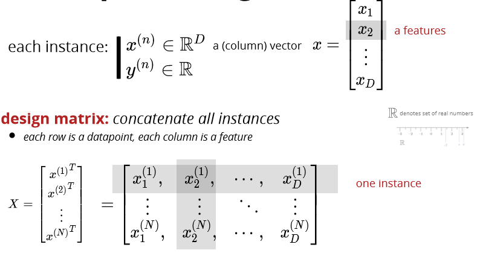

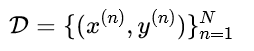

we assume N instances in the dataset each instance has D features indexed by d

## Linear Model

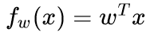

## Loss Function

Objective: find parameters to fit the data

Residual: 

Linear least square (L2 loss) cost function:

**L1 vs L2 Loss Function**

L1 and L2 are two loss functions in machine learning which are used to minimize the error.

L1 Loss function stands for **Least Absolute Deviations**. Also known as LAD.

L2 Loss function stands for **Least Square Errors**. Also known as LS.

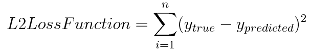

**AIMS TO MIN LOSS FUNTION:**

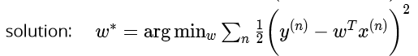

Derivative:

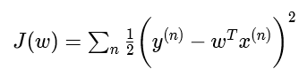 

Direct Solution:

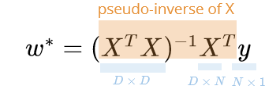

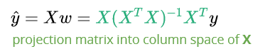

Linear for **large dataset:**

Stochastic gradient descent

what if X^T X is **not invertible**? (columns of X are not linearly independent, either redundant features or numFeature > numInstance; D> N)

Logistics

**Logistics is a linear classifier**

more than one class:  y ∈ {0,1,…,C} (**multi-class**: logistics fit C number of classifier and make prediction based on the most confident result), fit a linear model to each class, turn y into one-hot encoding: 

Linear regression is sensitive to the **outliers**

L2 loss **problem**: correct prediction can have higher loss than the incorrect one! 

Solution: Squash the loss function: 

Logistics:

Decision boundary:

## Logistic Regression Model:

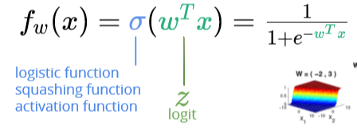

## Loss functions for linear classifier

Simplifying the cost function

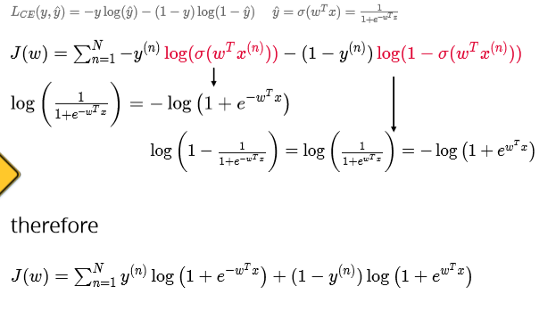

## Find the optimal weights

### Gradient

Logit function: 

## Likelihood

### Maximum likelihood & logistic regression

Cross Entropy loss deviated from log-likelihood of Bernoulli PDF

Minimizing logistic loss corresponds to maximizing **Bernoulli** likelihood. Minimizing squared-error loss corresponds to maximizing **Gaussian** likelihood (it's just OLS regression; for 2-class classification it's actually equivalent to LDA).

Log likelihood: why? Likelihood value blows up for large N, work with log-likelihood instead (same maximum) cross entropy

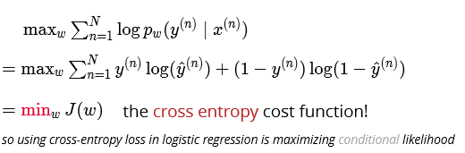

### Maximum likelihood & linear regression

Squared error loss:

## Multiclass classification

**Binary** classification: **Bernoulli** likelihood

C classes: categorical likelihood

**Softmax**

Softmax做事情就是对**最大值**进行强化 (for the reason why exp(z\_i))

 

if input values are large, **softmax** becomes similar to **argmax**

### Softmax likelihood & one-hot encoding

**Why one-hot encoding**: The integer values have a natural ordered relationship between each other and machine learning algorithms may be able to understand and harness this relationship

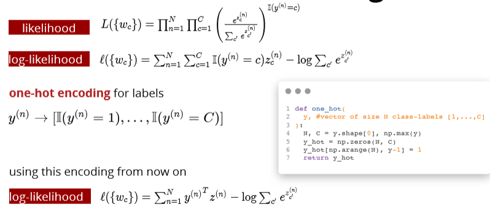

we can also use this encoding for **categorical inputs features**  one-hot encoding for input features

**Problem:** these features are not linearly independent, why? might become an issue for linear regression. why

**Solution:**

remove one of the one-hot encoding features

## Optimization

### Gradient descent!

Naïve Bayes

**Discriminative**: conditional distribution p(y|x) eg: linear and logistics

**Generative**: joint distribution p(x,y) = p(y)p(x|y) eg:

&#x20;Naïve bayes 

Example:

**in a generative classifier likelihood & prior class probabilities are learned from data**

Some generative classifiers:

* Gaussian Discriminant Analysis: the likelihood is multivariate Gaussian
* Naive Bayes: decomposed likelihood

## Naïve bayes model

NB **assumption**: 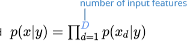

when features are **conditionally independent** given the label

## Max joint likelihood

Joint distribution: p(x,y) = p(y)p(x|y)

During training of NB:

During testing of NB: 

## Naïve bayes formula details:

## Class prior

**Choice of class prior depends on the type of classes**

**Binary classification:**

Bernoulli distribution: 

Max log-likelihood & get the max point: 

**Multiclass classification:**

Categorical distribution: 

Optimal parameters: 

## Likelihood

**Choice of likelihood distribution depends on the type of features**

## 

* Bernoulli: binary features
* Categorical: categorical features
* Gaussian: continuous distribution

**each feature may use a different likelihood**

**and separate max-likelihood estimate for each feature** 

## Binary features: Bernoulli NB

MLE: 

Implementation:

## Multinomial features:

Multinomial likelihood: 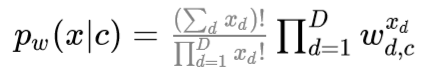

MLE estimates: 

## Gaussian features:

MLE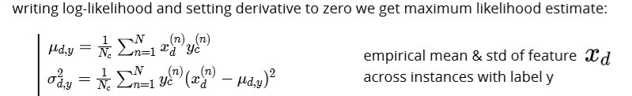

## Decision Boundary

two classes have the same probability: 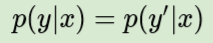

### Discriminative vs Generative Classification

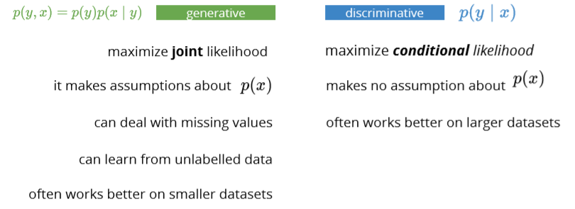

Regularization

**Avoid overfitting**

**When overfitting, we often see large weights**

Idea: penalize large parameter values

## Ridge regression

**L2 regularized** linear least squares regression:

Side note L2 norm:

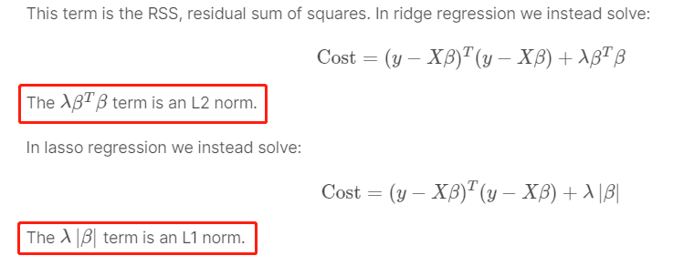

* regularization parameter  λ > 0 controls the strength of regularization
* a good practice is to not penalize the intercept

## Ridge weight formula

## Ridge with data normalization

**Without regularization**: 

**With regularization**: 

Diff features will be penalized differently

**Instead of maximize log-likelihood, we maximize the posterior**

## Maximum a Posteriori (MAP)

## Gaussian prior

## Laplace prior

Lasso 

## L1 vs L2 regularization

## Diff regularization subset selection

optimizing this is a difficult combinatorial problem:

* search over all    2^D     subsets

## L1 VS L0

It’s just like LASSO but has a little difference. LASSO has a limit:

the L1 norm of the parameters < t (some constant threshold)

For L0 regularization. The constraint is the number of parameters < t (some constant threshold)

Most people never heard about it because LASSO is good enough in the cases that people want to punish some parameters to zero. L0 regularization shares the same function with it. **The difference is L0 is more extreme than L1. The parameters are much easier to be punished to zero.**

If you have 500 features in the pool and you want 10 of them left, you can try LASSO. However, if you have 10k features in the pool and you want 10 of them left, you probably want to try L0 regularization.

## Bias-variance decomposition

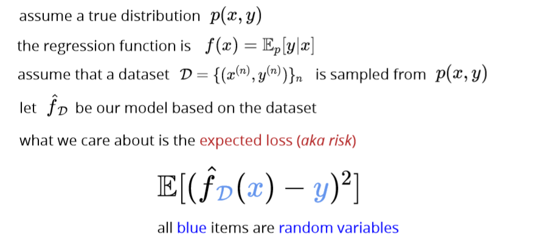

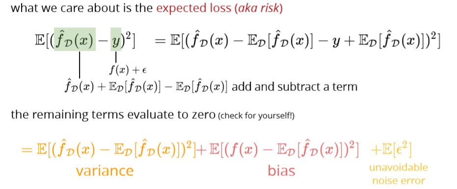

Larger regularization penalty -> high bias – low variance

high variance in more complex models means that test and training error can be very different

high bias in simplistic models means that training error can be high

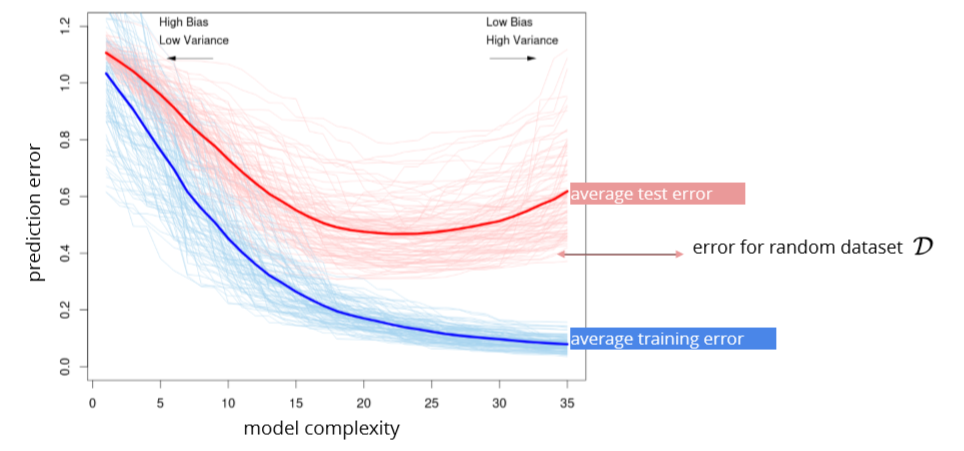

## Cross validation

k-fold CV

leave-one-out CV:extreme case of k=N

Test data:

once the hyper-parameters are selected, we can use the whole set for training use test set for the **final** assessment

## Evaluation

ROC receiver operating characteristic

How to graph: [https://acutecaretesting.org/en/articles/roc-curves-what-are-they-and-how-are-they-used](https://acutecaretesting.org/en/articles/roc-curves-what-are-they-and-how-are-they-used)

Gradient Descent

## Optimization in ML

## Gradient

Partial derivate 

## Gradient descent

Iterative algorithm for optimization

## Convex function

### Definition

Any two points can be connected by at most one line

### Why convex?

Convex is easier to minimize:

* Critical pts are the global minimum
* Gradient descent can find it 

Concave function

## Recognizing convex functions

## Gradient for linear and logistic

## 

Partial derivative w.r.t m

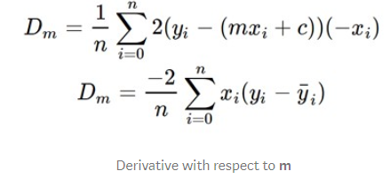

### Time complexity

### Codes

Example: 

### Learning rate alpha

Learning rate has a significant effect on GD

* **too small**: may take a long time to converge
* **too large**: it overshoots

## Stochastic gradient descent

Use average (expected value)

| **Batch gradient update**                                                                                                                                                                                              | **Stochastic gradient update**                                                                                                                                                                                                                                     |
| ---------------------------------------------------------------------------------------------------------------------------------------------------------------------------------------------------------------------- | ------------------------------------------------------------------------------------------------------------------------------------------------------------------------------------------------------------------------------------------------------------------ |
| With small learning rate: **guaranteed** improved at each step                                                                                                                                                         | The **steps** are “on average” in the right direction                                                                                                                                                                                                              |
|                                                                                                                                                                                            |                                                                                                                                                                                                                                        |
| computes the gradient using the **whole dataset**                                                                                                                                                                      | Stochastic gradient descent (SGD) computes the gradient using a **single sample**. Most applications of SGD actually use a **minibatch** of several samples                                                                                                        |
| Slower                                                                                                                                                                                                                 | Faster                                                                                                                                                                                                                                                             |
| Directly towards an optimum solution, either local or global                                                                                                                                                           | SGD works well for error manifolds that have **lots of local maxima/minima**. In this case, the somewhat noisier gradient calculated using the reduced number of samples tends to jerk the model out of local minima into a region that hopefully is more optimal. |
|                                                                                                                                                                                            |                                                                                                                                                                                                                                        |
| [https://stats.stackexchange.com/questions/49528/batch-gradient-descent-versus-stochastic-gradient-descent](https://stats.stackexchange.com/questions/49528/batch-gradient-descent-versus-stochastic-gradient-descent) |                                                                                                                                                                                                                                                                    |

### Convergence of SGD

Grdients will not reach 0 at optimum, how to guarantee convergence: **schedule** to have a smaller learning rate over time: learning rate is getting smaller while iterating.

## Minibatch SGD

### Codes

## Momentum

收窄SGD振幅：

* use a running average of gradients
* more recent gradients should have higher weights

Average moving:

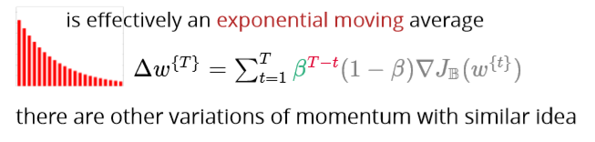

### Codes

## Adagrad (Adaptive gradient)

* use different learning rate for each parameter
* make the learning rate adaptive

useful when parameters are updated at different rates (e.g., NLP)

**problem: the learning rate goes to zero too quickly**

## RMSprop (Root Mean Squared Propagation)

## Adam (Adaptive Moment Estimation)

two ideas so far:

1\. use momentum to smooth out the oscillations

2\. adaptive per-parameter learning rate

both use exponential moving averages

The authors propose default values of 0.9 for β1

, 0.999 for β2, and 10^−8 for ϵ.

## Adding L2 Regularization

## Adding L1 Regularization

**Adding regularization can also help with optimization**

Evaluation

## Evaluation and comparison

Each model with same cost functions: report loss

Eg. Least squares or cross entropy

Each model with different cost functions:

Standard evaluation measures/metrics

## Performance metrics for classification

**False positive (type 1)**

**False negative (type 2)**

Eg: patient does not have disease but received positive diagnostic (Type I error)

patient has disease but it was not detected (Type II error) &#x20;

a message that is not spam is assigned to the spam folder (Type I error)

a message that is spam appears in the regular folder (Type II error)

confusion matrix

Accuracy, error rate, precision, recall, F1 score:

Fbeta score

### Example precision recall

### Less common metrics:

## Performance metrics for multi-class classification

Report average metrics per class, eg. Average precision

## Trade-off between precision and recall ROC\&AUC

**To compare classification algorithms compare their Area Under the Curve (AUC)**

Note that higher AUC doesn’t mean all performance measures are better

**Also important when comparing ranking algorithms e.g. search results**

**Intuition**: AUC is equivalent to the probability of ranking a random positive example higher than a random negative example

## Cross validation in Evaluation

Over-fitting in Model Selection

more severe on small dataset and when having too many hyper-parameters but present even with few hyperparameters (小数据更易，很多hyper结果跟很少hyper相似)

### Nested CV

Perceptron and Support Vector Machines

## Perceptron

### Objective

so perceptron tries to minimize the distance of misclassified points from the decision boundary and push them to the right side

### Optimization

### Codes

Example

**observations**: after finding a linear separator no further updates happen; the final boundary depends on the order of instances (different from all previous methods)

### Issues

cyclic updates if the data is not linearly separable?

* try make the data separable using additional features?
* data may be inherently noisy

even if linearly separable convergence could take many iterations

the decision boundary may be suboptimal

## Margin

### Max margin classifier

### Hard margin SVM objective

 

### Soft margin SVM constraints

allow points inside the margin and on the wrong side but penalize them

 

## Hinge loss

Why hinge loss:

We will punish the misclassified data points, which are located either inside the margin or wrong side of the margin, the margin is _distance from boundary._ If classify correctly, then no punishment.

In hard margin SVM there are, by definition, no misclassifications

### Perceptron vs SVM

* The Perceptron does not try to optimize the separation "distance". As long as it finds a hyperplane that separates the two sets, it is good. SVM on the other hand tries to maximize the "support vector", i.e., the distance between two closest opposite sample points.
* The SVM typically tries to use a "kernel function" to project the sample points to high dimension space to make them linearly separable, while the perceptron assumes the sample points are linearly separable.

The major practical difference between a (kernel) perceptron and SVM is that **perceptrons can be trained online (i.e. their weights can be updated as new examples arrive one at a time)** whereas SVMs cannot be. See this question for information on whether SVMs can be trained online. So, even though a SVM is usually a better classifier, perceptrons can still be useful because they are cheap and easy to re-train in a situation in which fresh training data is constantly arriving.

### 

### SVM codes

Hard SVM vs soft SVM vs Perceptron

## SVM recap

## SVM vs. logistic regression

Multiclass classification

Decision Trees

## Pros and cons

Pros:

decision trees are interpretable!

they are not very sensitive to outliers

do not need data normalization

Cons:

they could easily overfit and they are unstable:

avoid by:

* pruning
* random forest

## DT idea

## Prediction per region

### For regression:

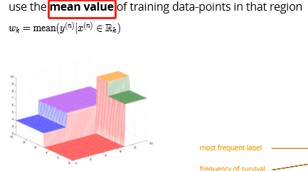

### For classification:

## Feature types

### Continuous:

### Ordinal:

### Categorical:

## Cost Function

### Regression cost

### Classification cost

## Search space

**Objective**:

find a decision tree with K tests minimizing the cost function; alternatively, find the **smallest tree (K)** that classifies all examples correctly

Assuming D features, how many different partitions of size K+1? the number of full binary trees with K+1 leaves (regions R\_k ) is the Catalan number 

 

## Greedy heuristic

* recursively split the regions based on a greedy choice of the next test
* end the recursion if not worth-splitting

## Stopping the recursion

if we stop when  has zero cost, we may overfit heuristics for stopping the splitting:

## Entropy loss

### Why?

entropy is the expected amount of information in observing a random variable **y**

## Mutual information

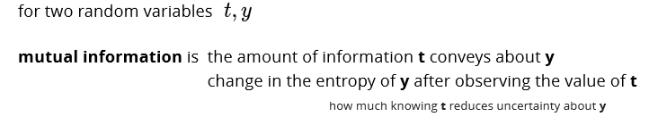 

## Entropy for classification cost

## Gini index – the way to split the tree

While building the decision tree, we would prefer choosing the attribute/feature with the least Gini index as the root node.

Information gain

[https://towardsdatascience.com/gini-index-vs-information-entropy-7a7e4fed3fcb](https://towardsdatascience.com/gini-index-vs-information-entropy-7a7e4fed3fcb)

## Overfitting

**large decision trees have a high variance – low bias (low training error, high test error)**

1. grow **a small tree**

substantial reduction in cost may happen after a few steps by stopping early we cannot know this

## Pruning

1. grow a large tree and then prune it greedily turn an internal node into a leaf node choice is based on the **lowest increase in the cost** repeat this until left with the root node pick the best among the above models using using a validation set
2. random forests (later!)

Bootstrap, bagging, and boosting

## Bootstrap

### Codes

## Bagging (Bootstrap aggregating)

**Use bootstrap for more accurate prediction (not just uncertainty)**

### Bagging for regression

Will lower variance but same bias

### Bagging for classification

mode of iid classifiers that are better than chance is a better classifier

* use voting

crowds are wiser when

* individuals are better than random
* votes are uncorrelated

### Example

## Random forests

Reduce the correlation between decision trees

Feature sub-sampling

only a random subset () of features are available for split at each step (further reduce the dependence between decision trees)

### Out of bag (OOB) samples

* the instances not included in a bootstrap dataset can be used for validation
* simultaneous validation of decision trees in a forest
* no need to set aside data for cross validation

**Out Of Bag (OOB)** error can be used for parameter tuning (e.g., size of the forest)

## Summary

* Bootstrap is a powerful technique to get **uncertainty estimates**
* Bootstrap aggregation (Bagging) can reduce the variance of unstable models
* Random forests (**subsample data and features**):
* Bagging + further de-correlation of features at each split
* **OOB validation instead of CV**
* destroy interpretability of decision trees
* perform well in practice
* can fail if only few relevant features exist (due to feature-sampling)

## Adaptive bases

### Optimization idea

### Example

## Exponential loss

note that the loss grows faster than the other surrogate losses (more sensitive to outliers)

AdaBoost

## AdaBoost algorithm

AdaBoost detailed derivations

Discrete AdaBoost

## Discrete AdaBoost Algorithm Example

### Example

**Decision stump: decision tree with one node**

## Gradient boosting

### Algorithm

## Gradient tree boosting

two ensemble methods

* bagging & random forests (reduce variance)
  * produce models with minimal correlation
  * use their average prediction
* boosting (reduces the bias of the weak learner)
  * models are added in steps
  * a single cost function is minimized
  * for exponential loss: interpret as re-weighting the instance (AdaBoost)
  * gradient boosting: fit the weak learner to the negative of the gradient
  * interpretation as L1 regularization for "weak learner"-selection
  * also related to max-margin classification (for large number of steps T)
* random forests and (gradient) boosting generally perform very well

## Some loss functions for gradient boosting

## !!!Boosting vs Bagging

1、Bagging (bootstrap aggregating)

Bagging即套袋法，其算法过程如下：

A）从原始样本集中抽取训练集。每轮从原始样本集中使用Bootstrapping的方法抽取n个训练样本（在训练集中，有些样本可能被多次抽取到，with replacement而有些样本可能一次都没有被抽中）。共进行k轮抽取，得到k个训练集。（k个训练集之间是相互独立的）

B）每次使用一个训练集得到一个模型，k个训练集共得到k个模型。（注：这里并没有具体的分类算法或回归方法，我们可以根据具体问题采用不同的分类或回归方法，如决策树、感知器等）

C）对分类问题：将上步得到的k个模型采用投票voting的方式得到分类结果；对回归问题，计算上述模型的均值作为最后的结果。（所有模型的重要性相同）

2、Boosting

其主要思想是将弱分类器组装成一个强分类器。在PAC（概率近似正确）学习框架下，则一定可以将弱分类器组装成一个强分类器。

关于Boosting的两个核心问题：

1）在每一轮如何改变训练数据的权值或概率分布？

通过提高那些在前一轮被弱分类器分错样例的权值，减小前一轮分对样例的权值，来使得分类器对误分的数据有较好的效果。

2）通过什么方式来组合弱分类器？

通过加法模型将弱分类器进行线性组合，比如AdaBoost通过加权多数表决的方式，即增大错误率小的分类器的权值，同时减小错误率较大的分类器的权值。

而提升树通过拟合残差的方式逐步减小残差，将每一步生成的模型叠加得到最终模型。

3、Bagging，Boosting二者之间的区别

Bagging和Boosting的区别：

1）样本选择上：

Bagging：训练集是在原始集中有放回选取的，从原始集中选出的各轮训练集之间是独立的。

Boosting：每一轮的训练集不变，只是训练集中每个样例在分类器中的权重发生变化。而权值是根据上一轮的分类结果进行调整。

2）样例权重：

Bagging：使用均匀取样，每个样例的权重相等

Boosting：根据错误率不断调整样例的权值，错误率越大则权重越大。(分错多的多权重)

3）预测函数：

Bagging：所有预测函数的权重相等。

Boosting：每个弱分类器都有相应的权重，最后voting时， 对于分类误差小的分类器会有更大的权重。

4）并行计算：

Bagging：各个预测函数可以并行生成

Boosting：各个预测函数只能顺序生成，因为后一个模型参数需要前一轮模型的结果。

[https://www.cnblogs.com/liuwu265/p/4690486.html](https://www.cnblogs.com/liuwu265/p/4690486.html)

Maximum likelihood estimation:

1. given a pdf
2. the pdf w.r.t X
3. Log step 2
4. Get the derivate = 0 w.r.t the estimator you would like to
5. Get the MLE w.r.t the estimator

[https://daviddalpiaz.github.io/stat3202-sp19/homework/pp-03-soln.pdf](https://daviddalpiaz.github.io/stat3202-sp19/homework/pp-03-soln.pdf)

pg. 4

Multilayer perceptron

## Adaptive Radial Base

## Sigmoid Bases

### Adaptive sigmoid bases

## Multilayer perceptron MLP

## Regression

## Classification

## !!! Activation function

### Logistic function

### Hyperbolic tangent

### ReLU

### Leaky ReLU

### Softplus

## Network architecture

Feedforward network aka multilayer perceptron

## Depth vs Width

## Multilayer perceptron

fully-connected: all outputs of one layer's units are input to all the next units

## Regularization strategies

### Overfit: variance reduction

Data augmentation (增大)

## Noise robustness

## Early stopping

## Bagging

## Dropout

Let's start with **normal dropout**, i.e. dropout only at training time. Here dropout serves as a regularization to **avoid overfitting**. During test time, dropout is not applied; instead, all nodes/connections are present, but the weights are adjusted accordingly(e.g. multiply the dropout ratio). Such a model during test time can be understood as a average of an ensemble of neural networks.

Notice that for normal dropout, at test time the prediction is **deterministic**. _Without other source of randomness, given one test data point, the model will always predict the same label or value_.

For **Monte Carlo dropout**, the dropout is applied at both training and test time. At test time, the prediction is **no longer** **deterministic**, but depending on which nodes/links you randomly choose to keep. Therefore, _given a same datapoint, your model could predict different values each time._

So the primary goal of Monte Carlo dropout is to generate random predictions and **interpret them as samples from a probabilistic distribution**. In the authors' words, they call it Bayesian interpretation.

Example: suppose you trained an dog/cat image classifier with Monte Carlo dropout. If you feed a same image to the classifier again and again, the classifier may be predicting dog 70% of the times while predicting cat 30% of the time. Therefore you can interpret the result in a probabilistic way: with 70% probability, this image shows a dog.

## Summary

* Deep feed-forward networks learn adaptive bases
* more complex bases at higher layers
* increasing depth is often preferable to width
* various choices of activation function and architecture
* universal approximation power
* their expressive power often necessitates using regularization schemes

&#x20;Gradient Computation & Automatic Differentiation

## Landscape of the cost function

## Jacobian matrix

## Chain rule

## Training a two layer MLP

## Gradient calculation

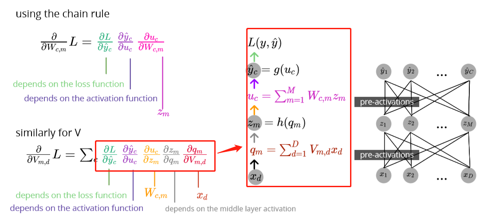

### For regression

### For binary classification

### For multiclass classification

Softmax: 

Code:

def softmax( u, # N x K ): u\_exp = np.exp(u - np.max(u, 1)\[:, None])

return u\_exp / np.sum(u\_exp, axis=-1)\[:, None]

xs = np.array(\[-1, 0, 3, 5])

print(softmax(xs)) # \[0.0021657, 0.00588697, 0.11824302, 0.87370431]

Cross entropy: 

def cross\_entropy(p, q):

&#x20;return -sum(\[p\[i]\*log2(q\[i]) for i in range(len(p))])

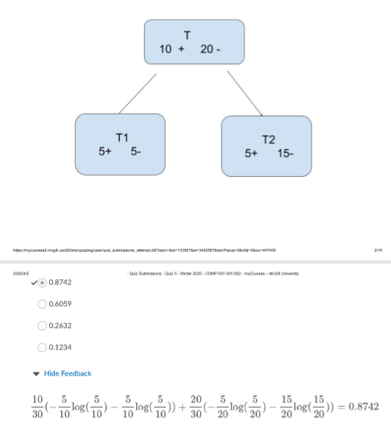

### Example:

Codes:

## Automating gradient computation

## Automatic differentiation

Backpropagation

## Forward mode

### Computational graph

## Reverse mode

### Computational graph

## Forward vs Reverse mode

## Summary

Backpropagation explain and resources

Suppose two hidden layers MLP:

**Backpropagation aims to find which weight/bias/activation function has the relatively larger influence on minimize the cost and update them correspondingly.**

For example:

This is the cost – weight/bias of hidden layer 2, to calculate the ratio between the weights (and biases) and the cost function. The ones with the largest ratio will have the greatest impact on the cost function and will give us 'the most bang for our buck'.

Ex. We want to increase the prob to classify it into 2, we would like to know which neuron’s weight/bias/activation has larger influence so that we can adjust them to get our desired output - 2, such as the yellow line.

We will have to average the changes

Math formula (output – the last hidden layer):

With multiple layers and neurons:

Calculating the gradient

Formula for the hidden layer 1:

Extra hidden layer:

**Summarization**

Resources:

[https://mlfromscratch.com/neural-networks-explained/#backpropagation](https://mlfromscratch.com/neural-networks-explained/#backpropagation)

[https://www.youtube.com/watch?v=Ilg3gGewQ5U](https://www.youtube.com/watch?v=Ilg3gGewQ5U)
